笔记，是人类获取和记录资讯的基石，无论在学习或工作中，都扮演著重要的角色。然而，笔记的效率和成效却是一个普遍存在的问题。

无论是学生抄写课堂笔记，还是职场上记录会议内容，人们常常面临笔记杂乱、找不到重要资讯、或是灵感消失无踪等困难。

作为一名学习专家，我也曾经为这个问题困扰许久。我曾经试过许多不同的笔记方法和软体，从最早的手写笔记本，到后来的Word+资料夹，再到使用Evernote收集笔记，甚至尝试过心智图和卡片笔记法。

然而，这些方法和软体都无法完全解决我在笔记领域中遇到的种种问题。

直到一个契机。当时的我正在研究一套现代笔记软体，并想举办功能读书会。在会前，我进行了一次意见调查。当时，原本我心中的假想，是大家会对这套这软体里面一些细部好奇。

然而，在收到问卷的回馈后，我却相当意外。大家对于这套软体几乎没什么疑问。大家所提出的问题，竟然多半是传统笔记方法所遇到的困境。

这让我意识到，在笔记流程上。过去似乎我们都有共同错误努力。

读书会总共收到了一百多个回应。

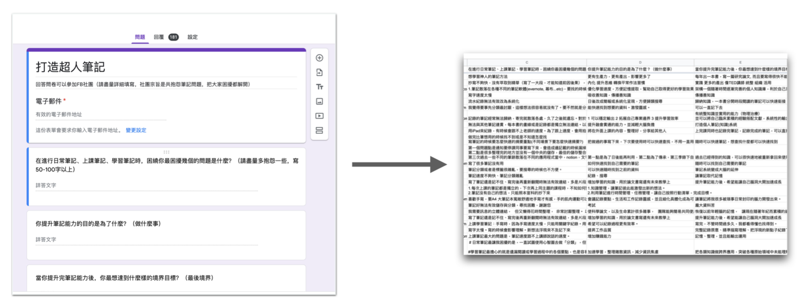
本来，这个读书会原意，是交流这套软体的功能。但在看完大家的问卷回馈后，我发现大家在这场读书会，更加想知道的是更底层的议题是：「究竟如何将笔记做好」？

读书会的方向完全错误。但这也让我从中窥见到一个惊天大秘密：笔记是我们在学习路上最常使用的工具，但在过去的教育中从来没有人教过我们如何做笔记。大家都是凭直觉在暴力作笔记。

这引起了我的好奇心和研究兴趣。

## 重新梳理流程

那么，我们共同的瓶颈点在哪里呢？

我将收集到的问题进行了标记后，发现在这个领域中存在著十几种、二十几种、甚至更多不同类型的困扰。

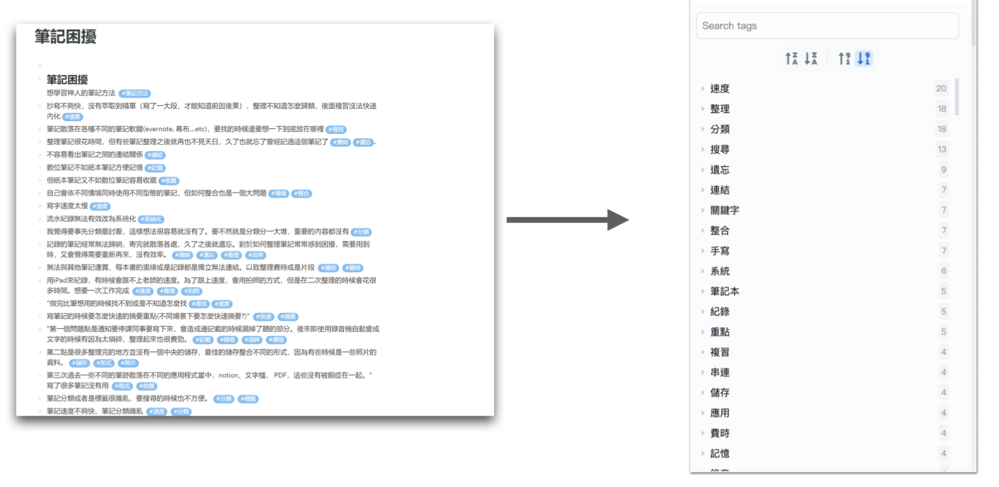

我发现原来笔记界困扰大家的真正问题，并不是单纯「如何记录」以及「如何重新应用」。而是分为五大类，围绕著：纪录、整理、搜寻、应用、软体。

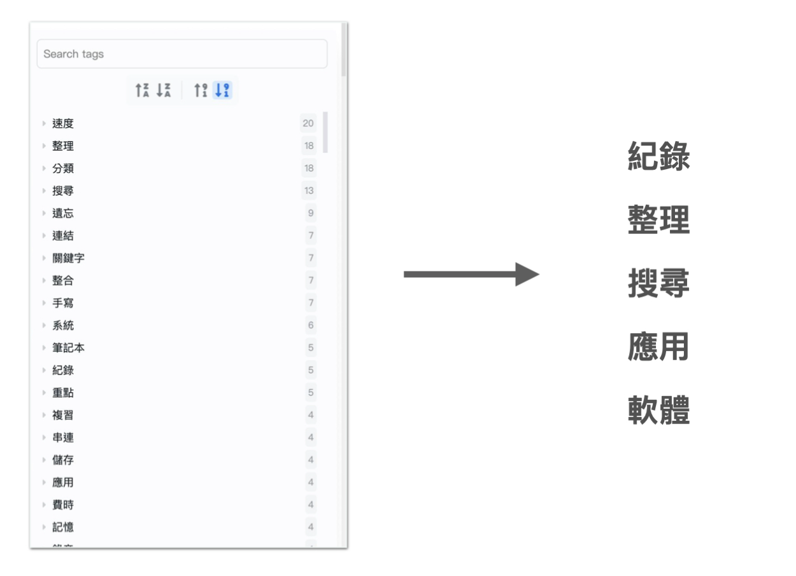

  * 如何快速纪录？
  * 如何有效纪录？
  * 如何快速整理？
  * 如何有效整理？
  * 如何快速搜寻？
  * 如何有效搜寻？
  * 如何快速应用？
  * 如何有效应用？
  * 要用哪些方法、工具、软体做到上述这一切？

而且，五个关键字是以这样直观顺序排列的：

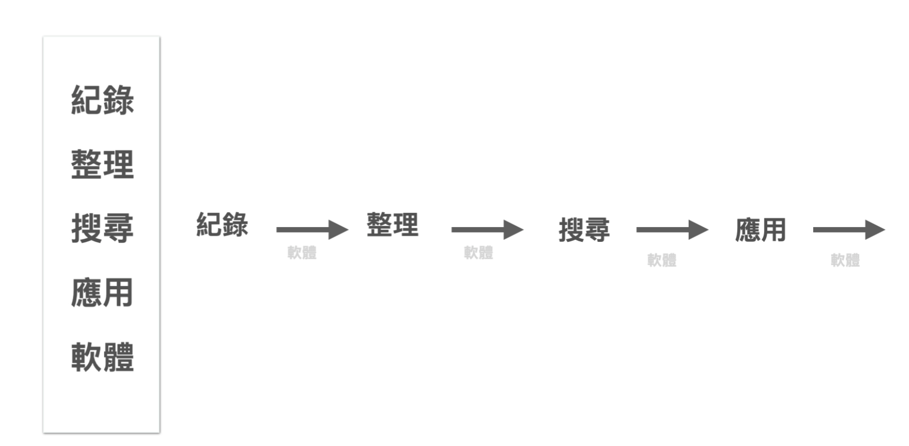

乍一看到这张新的流程图，读者可能觉得十分合理。

彷佛我们天生笔记的流程就应该是这样进行的。

但是为什么我们还是在日常笔记纪录、整理上踢到铁板呢？

因为我们正常人，真正在做笔记时，并不是这样执行的。

## 现实世界的笔记术：同时纪录与整理

市面上几乎所有的笔记法，都在使用相同一个流程：

****同时纪录与整理****

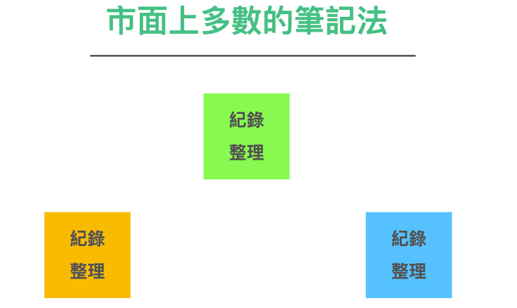

同时「纪录+整理」这样的方法似乎合乎人类直觉。

但是这个方法，在后续实际操作上。特别是需要搜寻笔记内资讯时，却变得相当困难。

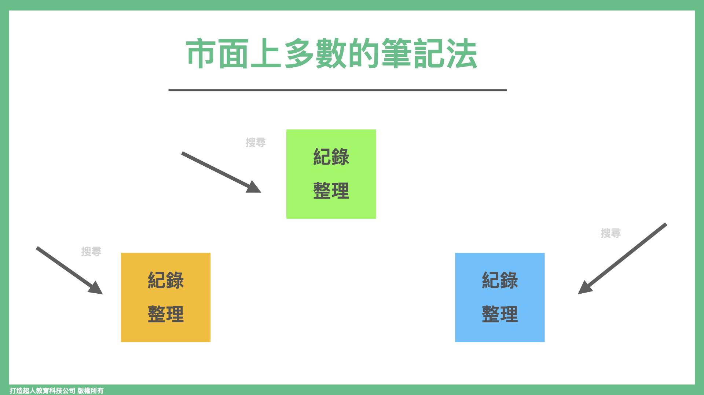

同时，若后续要将多本笔记的资讯整合在一起，也几乎是不可能的，需要付出极大的努力。

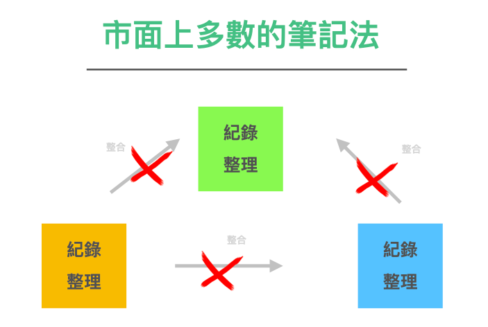

## 高效的笔记术：将记录与整理分开

同时纪录与整理似乎是一个很直观合理的笔记技巧。然而，在我对笔记学这门学问进行反思后，我发现这种方法其实非常违反人类大脑的运作原理。

怎么说呢？

接下来，让我来慢慢解析一下人类大脑在上课时的思维过程，希望能帮助你理解这个问题。

一般人的大脑是这样运作的：

首先，在上课时，人类接收到许多讲者提供的资讯和观点。

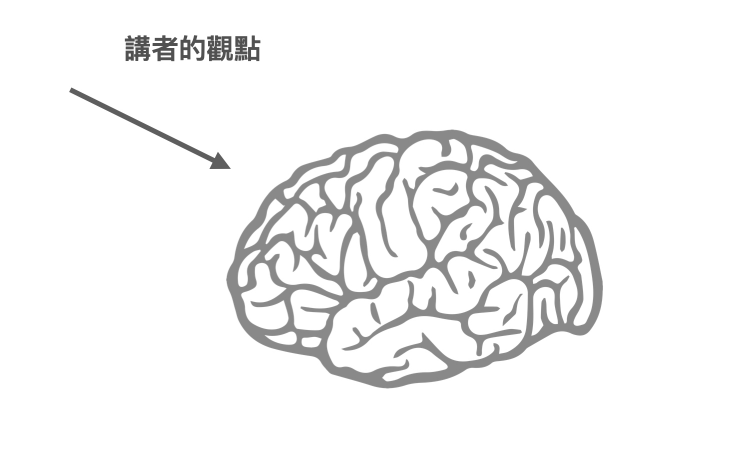

其次，基于这些资讯，你会产生自己的想法和诠释。

这时候，你的大脑会开始快速运作，产生大量的想法。

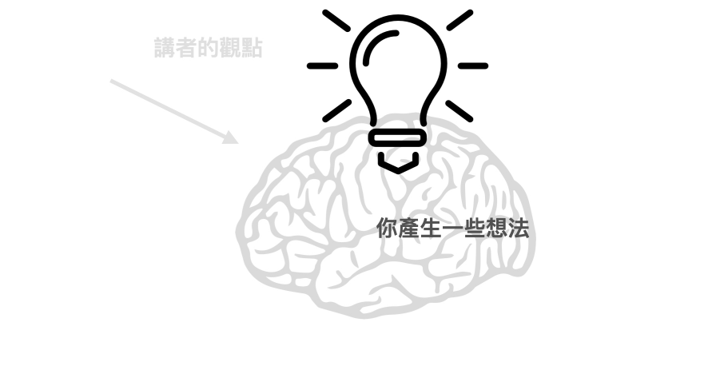

这时候，大脑面临一个决策问题：

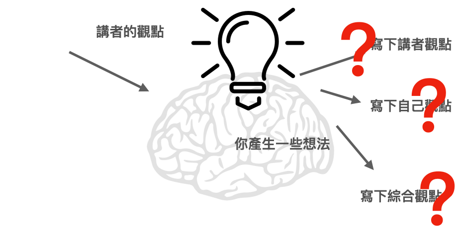

当接收到外界的信息时，我们到底应该记录

* 讲者的观点？
* 自己的想法？
* 或者两者的结合?

这也恰恰是我们在做笔记时最容易面临的困境。

#### 按下暂停键，平移时间轴

那么，又要如何解开这个问题呢？

一个简单的方法是，将这些问题分开处理，不要同时处理，一个一个逐个解决。

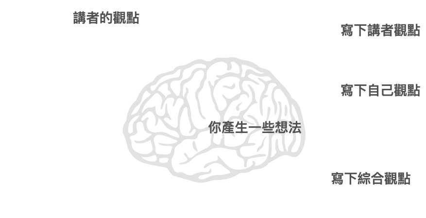

比如，现在科技很发达，所以可以这样做：

在「记录讲者观点」这个动作上，使用录音笔、录影机、相机去记录资讯。这样一来，就不会有「来不及抄」或「纪录的不仔细」的问题。

而后就有足够充裕的时间「写下自己观点」。

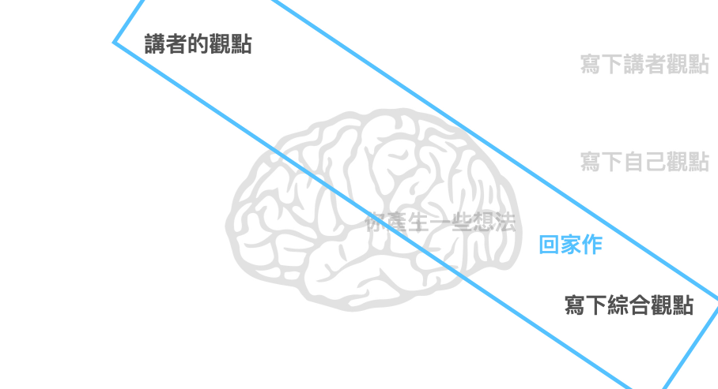

光是按下暂停键，加入一点科技流程，就可以产生很大的改变。

### 在时限内整理复习

当然，只有前两者是不够的。因为没有经过整理且内化的内容。是无法留存在大脑之中的。

我通常的建议是，在初步抄写纪录后，后续得在时限内（大脑记忆的保鲜期限通常是回家当天，当周末，两周内）拨空，将「讲者观点」与「自己观点」两份资料，整理「写下综合观点」，再进行有效的吸收。

这才是执行一份有效「上课笔记」的完整流程。

#### 学习术才是笔记术的核心

在从前，单看「笔记」这个议题，会以为「如何将资讯快速记下」才是重点。但我认为整个笔记术的核心，重点应该是后续的学会用笔记进行「学习」。

毕竟我们记笔记这件事，从头到尾都是为了「学习」。

而笔记的存在，本就是是为了降低学习过程当中，我们大脑储存/处理资讯的压力。

第一：缓冲过滤外界大量的资讯，

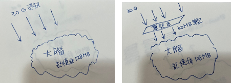

第二：切成可以进入大脑的尺寸大小，让大脑可以在脑中梳理排序，在脑内搭成有效的记忆网路。

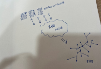

只是过去大家都在第一关就摔倒了。

就算侥幸能闯到第二关，也通常也会因为种种因素（耗时、费力、部分遗忘）而放弃。

所以我认为，有效的笔记术应该是

1.     了解原先目标：最终是为了强化我们的学习效果
2.     清楚当中流程：而是重新了解资讯进到大脑需要五道流程：纪录 -> 提取 -> 整理 -> 搜寻 -> 应用
3.     用工具提升速度：合理利用现代工具辅助、降低大脑的储存与搜寻压力

最终达到笔记境界的终极理想：

* 能够快速的捕捉资讯
* 轻松的整理
* 后续能够快速搜寻到结果，实战应用。
* 利用同样的流程，可持续不断的增添新笔记，与过去自己研究的 SOP 、洞见整盒，做到可以彼此串连
* 逐步累积成自己的私有领域百科。

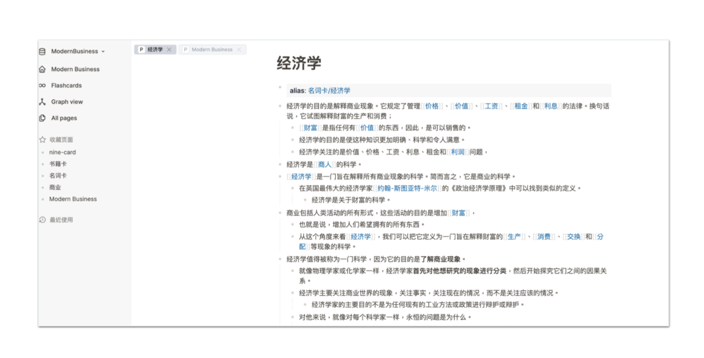

当然乍听之下，做起来似乎需要投入不少精力。一般人做得到吗？

我向你保证。其实是可以做到的。而且这个新流程实际上是比过去轻松省力数倍，而且做起来比大家想像的要简单得多。

在之前的读书会上，不少成员在采用了这个新流程之后，仅用了一天的时间就掌握了其要领，三天之内就深深著迷，成为了笔记狂魔。同时，他们也成功建立了自己的知识宝库。

我出版这本书的原因之一，是因为这个议题一直困扰著太多人。但「合理」的流程实际上非常简单和高效。我们没有理由不与更多人分享，造福更广大的读者。

### 解开整理无穷回圈，记出有效又有用的笔记

我们在本节前段，点出了做出高效笔记的第一个关键作法：

> **放弃同时「纪录」与「整理」**

现在，我们将更深入地探讨以下几个流程步骤：

* 纪录
* 整理
* 搜寻
* 应用
* 软体

一步一步地探讨，我们将让你的笔记流程变得更加高效和有效!

通过对这些流程的深入理解，你会发现自己在短短几天内就能逐渐变身成一位笔记达人。

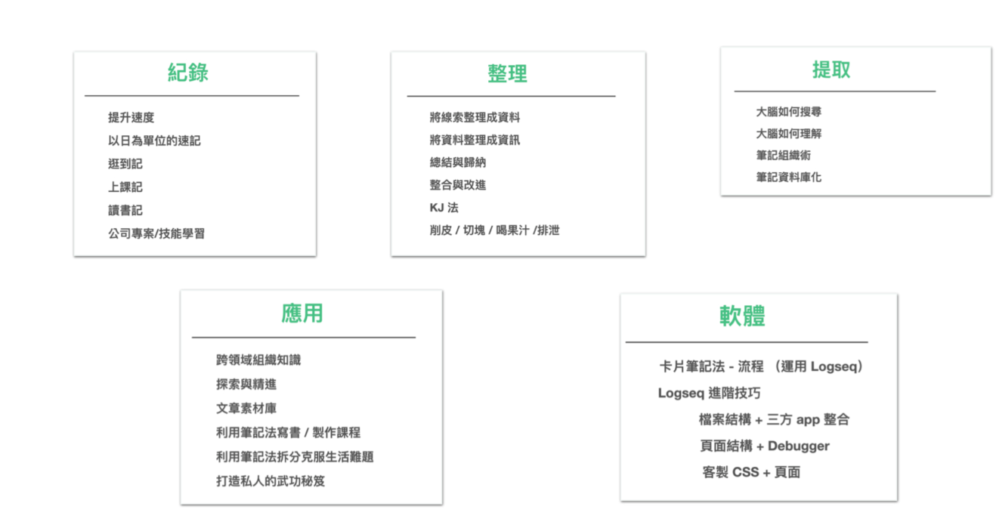

（这张图等全书定稿之后会重做）