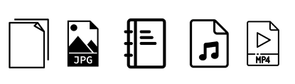
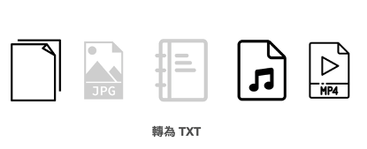

在开始进入场景之前，我们要先谈一点能够提升纪录速度与日后查找的小诀窍。

我们之前提到，其实我们完全可以使用机器来取代我们的「笔记记录」工作。

但是，事实上，我们可以更进一步，甚至可以使用机器来取代我们的「大脑储存」工作。

这是什么意思呢？

我们人类的大脑之所有容易遗忘事情，是因为容量有限。而我们之所谓的「记忆」，并不是「资讯」本身，80% 都只是关于「资讯的索引」。

所以我们完全没必要去背上很多东西，甚至我们更要把这些东西放在可以很快调用的设备上。

一般人在笔记管理这个议题上，往往有个共同的困扰，就是需要过去这些笔记时，很难找得到或有效调用。

因此，我强烈建议将这些资料和资讯直接电子化成档案，例如放在Dropbox上，这样就可以随时存取。

然后进行简单的档案整理，就可以实现「一次写入，随处存取」的效果。

### 1. 将档案变成文字

一般来说，我们日常的载体有五大类：

在我们日常生活中，常见的资讯载体可以分为五大类：

* (1) 文字
* (2) 图片
* (3) 书籍
* (4) 声音档案
* (5) 影像档案

通常，我会将文字、书籍和影像档案整理成文字档案。(而声音档案和影像档案则可以透过听译软体转换为文字)

这样做的好处在于，现今的电脑内建搜索功能通常非常强大，只需输入关键字，便能轻松找到所需内容。将声音档案和影像档案转换为文字档案的好处更在于，能够节省回顾内容所需的精力，快速定位到所需部分，并且能够对段落资讯进行搜索。

### 2. 将档案变成照片

而我会将 (2)(3) 变成图片（照相起来），甚至在路上看到一些有趣的事情，刷 FB 看到一些有趣的文章，一样会用截图功能保存。

### 用符合大脑特性的方法建索引

为什么要多做这两件事呢？因为大脑回忆事情的方法，通常只有这两种：

* 按照日期
* 按照关键字

一般来说，手机内保存的照片都是用日期排序。要找到前几天前几个月发生的资讯，往上滑几下就可以找到了。

而有了电脑的帮助，即使只记得一些简单的关键字，也能轻松地找回当初保存的大量信息。

使用这种方法，你实际上不需要使用特殊的笔记软件来做笔记。只需利用手机和电脑内建的功能（拍照、截图、文件搜寻），就能快速且轻松地找到所需的信息。

## 五种场景模式

以下，我会基于上述这个概念，讲解各种场景的的不同笔记法。详细介绍如何在不同情境下进行笔记，以达到高效且有效的效果。

为什么不同的场景需要不同的笔记方式呢？

因为他们的「目的不同」，导致需要的记录结构与方式也不同。

* 随手记需要快速捕捉重要的想法和资讯
* 上课笔记需要有组织性和完整性
* 读书笔记需要深入思考和分析
* 会议笔记需要快速捕捉与产生会议行动
*  练功笔记需要目标和反思

选择适合的笔记方式和工具，能够帮助我们更好地记录和理解内容，并提升学习和工作效率。