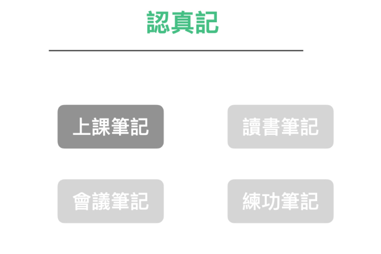
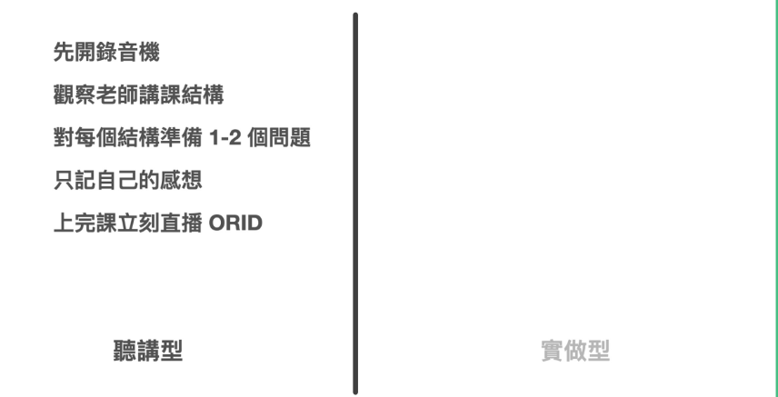
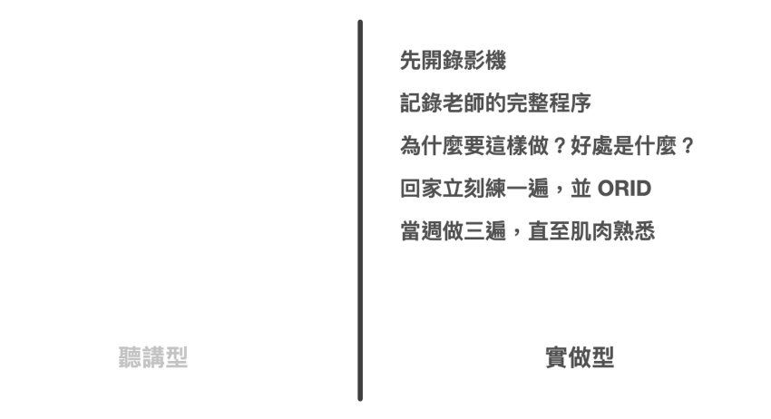

在上课时，笔记需要有组织性和完整性，以便后续复习和学习。

做上课笔记，很多人纠结的重点在于可能是要专心听还是专心记。要用笔记、打字记还是拍照记？

但我认为重点都不是以上。而是要先厘清课程的格式。

一般来说，市售课程分两种，一种是概念听讲型、一种是流程操作型。

Ÿ   听讲型的课程是上课时，老师说你听

Ÿ   实做型的课程是上课时，老师示范你操作

这两种课程的上课笔记操作方法，其实是完全不一样的。

### 听讲型课程如何做笔记？

听讲型课程，比较常见的情形是演讲或者理论课。

但坦白说上这种课时，非常赌运气。有的老师一次就能吸住学生注意力一两个小时，让学生直到下课都还依依不舍离开。有些老师，刚开场五分钟学生想放空逃离，或者直接去找周公。

若是遇到后者的情形，真的会非常倒楣，烂老师东拉西扯，自己又无法离场，甚至还得聚精会神，想办法从里面找到点干货，来对得起当初自己交的学费。

但无论老师本身能力如何，上课做笔记本身就是一件挑战度相当高的事情。

因为老师提供的信息是通过声音传递的，你必须先将声音转化为脑电波，并过滤出需要记录的内容或者你自己的想法。

而且你无法快速跳过每一秒的声音。

这也是为什么上课会让人感到疲惫的原因，无论是否做笔记，都需要消耗巨大的能量。

然而，有一些方法可以帮助你更有效地做笔记，降低做笔记的成本。

### Step 1: 开录音笔

在上这种听讲课时，我建议的第一个动作，就是开录音笔。

第一个好处：资讯不会漏接，而且下课时，甚至就能拿到听译服务的逐字稿进行复习。

第二个好处：当自己知道无论如何都有录音笔音档垫底时，大脑就不会那么紧张，害怕漏接了什么资讯，而在一开始就消耗了不必要多的注意力与能量在纪录(Record)资讯之上。我们可以可以将大部分的能量分配给真正有意义的事情（产生与捕捉洞见）。

### Step 2: **观察老师授课结构

老师的教学能力参差不齐。有些老师只是擅长表达自己的经验，但实际上他们的授课内容可能杂乱无章，甚至会浪费很多时间。

然而，高效的老师会为他们的授课内容建立一个清晰的结构，使学生更容易理解和吸收知识。

我建议在上课时，不论老师的教学能力如何，都可以花一些时间观察老师的授课结构。因为一旦你了解这堂课的结构，你就可以像有进度条一样上课了。

这样的观察让你能够专注于你感兴趣的议题，同时放弃你不感兴趣的议题，从而节省精力。这样的学习方式能够提高你的学习效率，并且让你更容易记住所学的知识。

### 步骤3：转换成主动式学习心态

听讲课让人感到疲劳的原因是听课者不知道讲课者的教学目标，只能被动地听取讲课者提供的信息并搜索答案。

听课者预设所有的资讯都应该是重要的，因此花费了大量时间解码每一段资讯。但最后80%的资讯都是不重要的，能量都被浪费掉了。如果讲师没有讲授技巧或者没有重点，那么这堂课的学习效果将非常差甚至等于零。

所以换个角度，如果我们上课前先准备一些自己原本就很感兴趣的问题，专心在这堂课里找答案呢？

有了这些问题，再加上观察结构。我们就等于开了滤镜模式，等于所有内容都可以放掉，等到出现自己觉得相关的关键内容时，再专注即可。

这样的心态与方法，就不会让自己在上课时非常累，甚至反而最后甚至会产生「这门课非常棒，我想知道的都得到了解答」。

这是一种非常不同的积极成果。

即使你错过了某些部分，也可以通过后续的录音听译和笔记来弥补。看文字和做笔记的好处是可以直接用眼睛搜索要找到的资讯，并随时快进倒退，而不必从头到尾重新听一遍。

这样你就可以专注于你感兴趣的议题，而放弃你不感兴趣的议题，从而节省精力。

这种主动式学习心态不仅能提高学习效果，还能帮助你更好地理解和应用所学知识。

### Step 4: 只记自己的感想

使用这种方法，你就不需要只是机械地记录老师讲的内容，而可以专注于写下自己对于所学知识的感想和发现。这样的笔记方式能够帮助你更深入地理解和吸收所学的内容，并且让你在回顾笔记时更容易回想起当时的思考和感受。

这样的笔记方式才是你上课真正想要得到的结果！

### Step 5 : 重新讲述一遍你的心得，并录影存档

最后一步，也是最重要的。

在上完这门课时，立刻找同学、直播、录影讲一遍这个课的 ORID。

ORID指的是：

ORID 是

* 我看见了什么
* 我感觉到了什么
* 我领悟了什么
* 我决定去做什么

为什么「立刻重述」这件事情这么重要呢？

这是因为在上课之后，我们刚刚得到一些资讯。这些资讯，在我们的大脑中，还仅是一些零散的想法与线索而已。

而经过当场讲述这个方法，可以立刻在脑子里面粗略建构一段用自己观点表达的「完整新记忆」。

这才是能让大脑真正产生有效索引的方法。因为大脑本身，只会纪录

* 有具体结构的资讯
* 与我有关的资讯
* 
否则过了几天，不管当下自己抄了什么，记录的多详细，当天没有经过这样一轮的索引创建，大脑一样会把这些「影像」冲刷的干干净净。毕竟人类内建的「行车记录器」硬碟储存空间有限。

这当中该注意的诀窍有几个：

1. 强烈建议在上课完的中午或晚上，立刻做一遍。记忆是有关于保存期限的。这个方法等于是立刻作保鲜处理，确保你的记忆能够长期保存。

2. 讲述比书写更有效。而且讲述会在大脑中产生声音记忆，这样可以更好地记住内容。

3. 讲述的内容比书写或打字输出的内容更多。录制下来后，又可以转化为逐字稿，这样你可以更详细地回顾和总结课程内容。

4. 在当周重新整理资料。口述只是记忆巩固的第一步，将它整合到已有的知识体系中需要进一步的整理。在后续章节中，我们将深入讨论整理的技巧，帮助你更好地整理和组织学习资料。
5. 

## 实做型课程如何做笔记？

在参与实践型课程时，有几个方法可以帮助你有效地做笔记：

1. **录制视频或拍摄照片**：如果允许的话，使用相机或录影机记录老师的每一个步骤。这样做的原因是因为在实践型课程中，程序性知识的步骤顺序非常重要。这样你可以在需要时回顾和模仿老师的动作步骤。

2. **问问题**：如果你对老师示范的步骤或顺序有疑问，可以在下课时询问老师。这样你可以更好地理解为什么顺序是这样，以及一些细节的好处。你可以使用录音设备记录下老师的解释，以便日后回顾。

3. **进行练习**：回家后，立即进行一遍的练习。这样可以帮助你巩固所学的知识和技能。在练习过程中，你可以将自己的练习结果进行一次讲述的 ORID（Objective, Reflective, Interpretive, Decisional）分析，以帮助你更好地理解和记忆所学的内容。

4. **多次练习**：在当周至少要做三遍的练习。这样做的原因是，在学习程序性知识时，我们需要使用肌肉记忆而不是大脑记忆。通过多次练习，你可以更好地培养肌肉记忆，使所学的知识和技能更加熟练。

总之，实践型课程需要采用不同的笔记方法，包括录制视频、问问题、进行练习和多次练习。这些方法可以帮助你更好地理解和记忆所学的内容，并提高你的实践能力。

这样做的原因是，在学习程序性知识时，我们需要使用肌肉记忆而不是大脑记忆。

#### 没有万用笔记本与软体，但有超级捷径

为什么在本章我们要将「记录」与「应用场景」各个分开讲述。是因为很多人在学习笔记技巧时，认为使用一种笔记本格式或一套笔记软件可以解决所有问题。

然而，实际情况并非如此。即使是在上课中，笔记也可以分为听讲型和实践型，侧重点也不同。因此，对于接下来的四个场景，我们将提供不同的解决方法。

透过上课例子，我们希望向大家展示笔记技巧并不仅仅是暴力记忆和整理这么简单。然而，将其分为不同的场景并不是为了让笔记技巧变得更加复杂，而是反而要让笔记流程更轻便、结果更有效。

我想要强调的是，要做到有效的笔记，不是通过用大量的粗暴记录和整理来消耗人体能量。

要做到高效的笔记，我们需要先思考，我们做笔记的真正目的是什么。然后，利用人类天生的机制和现代科技，找到最简单的方法。这样才能事半功倍。