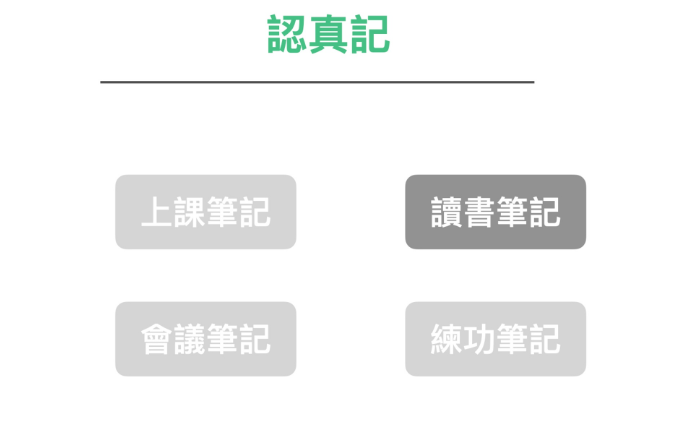
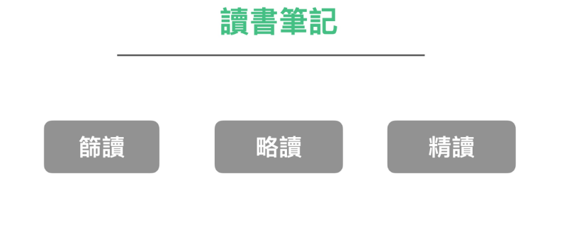
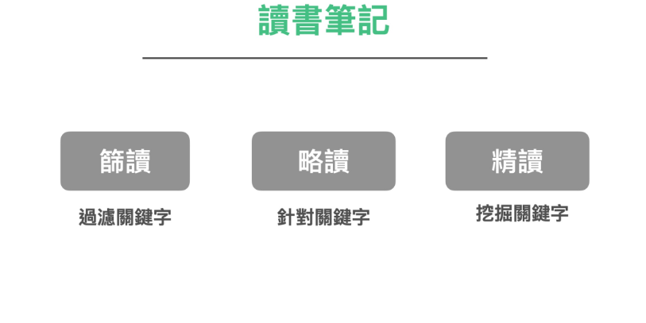
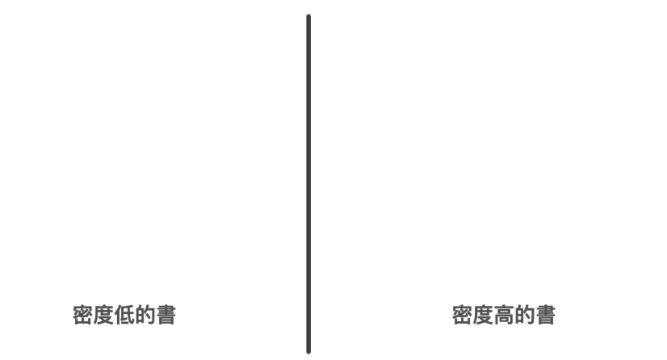
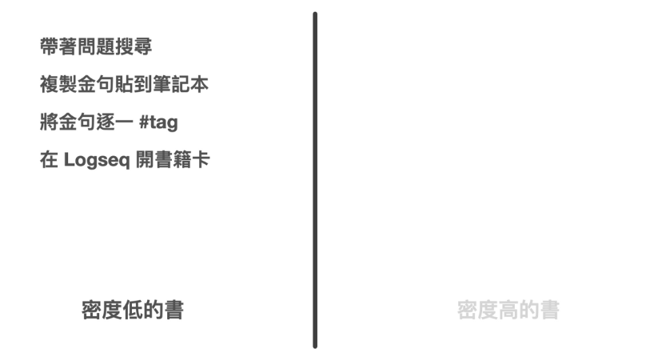
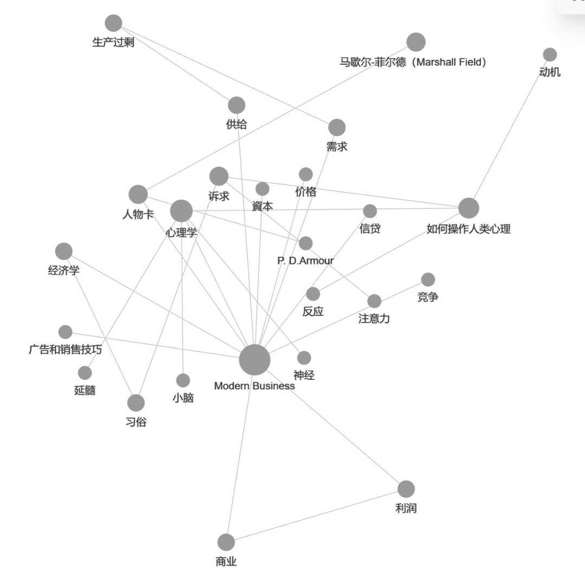
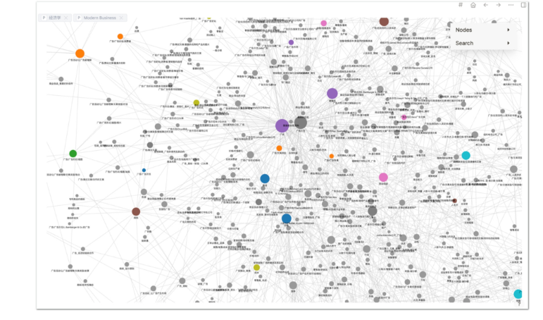
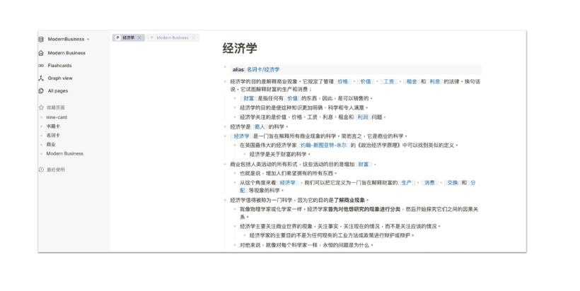

当您阅读一本书时，笔记需要更深入的思考和分析。

常见读书笔记的形式有：

* 划线笔记：通过在书上划线或标记重点句子，快速捕捉到关键信息。

* 在书上做笔记：在书的空白页或边缘做笔记，详细地记录自己的思考和理解。

* 抄句子在笔记本上做笔记：在读书时遇到一些特别有启发性或重要的句子，将这些句子抄写在笔记本上，并加上自己的注解和思考。

* 写读后感：阅读完一本书后，写下自己的读后感和心得。回顾和检视自己的阅读成果，并将所学应用到实际生活中。

但究竟在阅读时，我们应该选择哪种方式记录笔记比较好呢？

我认为我们不应该这样武断的推论。

更准确地说，读书笔记需要根据不同的场景进行分类。

在《打造超人学习》的读书篇中，我介绍了一种阅读方法论。

这套方法论，把钻研一个领域的书，分成三种阅读模式：

### 第一：筛读

许多人在读书时，常懊悔自己浪费时间买了难啃难读或非常水的错书。但我计算过，其实买错书非常正常。我自己实测的结果是，买到一本具备正确资讯（符合我们当前程度，且是自己认同且需要）的书，在书市上的机率最多也只有 50% 而已。

如果一开始就花了大笔力气去精读一本错的书，那岂不是把力气花的很冤枉吗？

所以在钻研一门新领域时，要采取筛读 -> 略读 -> 精读的一个流程。

在第一轮筛读。只需要大致翻翻拿到的书籍。目的是找到这个领域重要的关键字、问题、论述。锁定一批书可以进行下一轮的「略读」

在略读过程中，再过滤出一两本真正够好的书，进行精读。

在略读时，我们粗略的画线即可。而在精读时，才要认真的去做笔记。

### 如何精读一本书

### 如何精读

那么我们又要如何精读呢？

而且，就算是精读。实际上都有分两种模式：密度低的书与密度高的书，两者精读方式是截然不同的。

一般来说，对于资讯密度较低的书。我会采取类似极速读书法的阅读方式：

1.        先对这本书准备一些基本的问题。
2.        然后带著问题搜寻我要的答案
3.        将在书本中看的金句一一复制贴到数位笔记本之内
4.        看完之后再对金句逐一的打上 #tag 做点轻分类
5.        将这本书的金句搜集成一张该书的书籍金句笔记卡

而资讯密度较高的书，我就会反过来操作。

这类书籍，整本书上金句太多，一句一句复制贴上太累。于是我采取的方式是：

1.        一次将一整章书内容贴到数位笔记本内
2.        将不要的句子砍除
3.        将砍剩下的内容重新编排成我自己要的新结构
4.        将这本书当中出现的名词或概念，在笔记软体上整理成 「卡片」
5.        重复整理过去的卡片，利用名词相连，找到相关的资讯比对编删，重新组织出新的卡片、新的见解。

### 卡片笔记法

在精读模式的章节中，对于「将金句复制起来贴到笔记本里」、「整理成卡片」、「打上 Tag」「用软体串连在一起」，读者听到这套模式可能听起来很惊奇，会觉得怎么可以如此操作？

但这其实是一个几十年前就被发明的方法，只是当年没有软体，笔记方法的设计者，当年用的方式是土法炼钢的纸质索引卡片。

是的。这套方法就是最近十年开始「红」起来的卡片笔记法。

卡片笔记法是由德国社会学家卢曼 Niklas Luhmann 所发明。他在 30 年多年间的研究生涯中，一共出版了 58 本著作与数以百计的论文，当中还横跨多个领域。

当时，他发明了一种卡片笔记法。他将有兴趣与搜集到的资讯，随时捕捉到卡片之上。等到这些资讯卡片累积到一定程度时，就重新整理这些卡片，进行创作。这种卡片笔记法，成了他的高产秘密武器。

这个方法乍听之下很费工，很多人羡慕卢曼的高产，但很少人会实际去跟随这个流程，因为光想像流程就觉得很花时间。

但我自己在实测之后，才发现卢曼这种笔记方法，其实一点都不费工，反而非常科学与高效。只是一般人并不知道如何入门这套笔记方法。

卡片流程法在一边传统「记录」->「应用」的流程，复杂到无法想象。

但是卡片笔记法本身的思维在「纪录」->「整理」、「搜寻」->「应用」->「软体」用起来就像雷神之槌般威力无穷。

我曾经用这种方法搭配上现代最新的一套笔记软体 Logseq阅读了一套 1200 万字的美国经济学古书《Modern Business》。在两三个月的时间里，写了两三千张知识卡片。

这些卡片不仅让我最后读透了古典经济学，从卡片的交叉词条中，我更从中发现了许多现代经济学中自相矛盾或虚幻的立论与假设。

我才领教到这套卡片笔记法威力之强大。后续研究各种艰深的探索性学问。我都使用这套方法。并且挖掘出很深的洞见。

作者注：

我们在目前的章节中，卡片笔记法暂时点到为止。

本书的讲述结构是帮助大家正确建立梳理资讯的流程和方法，唯有理解：「纪录」->「整理」、「搜寻」->「应用」->「软体」这套新流程思维，才挥得动这把槌子。

后续的章节我们将继续回来为大家讲述这套笔记法。
