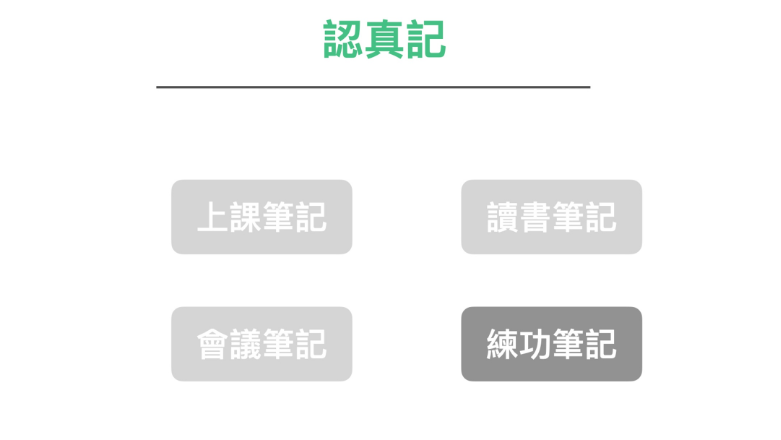
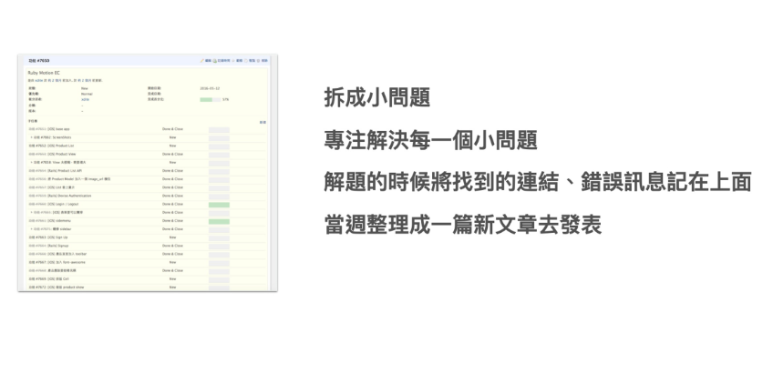
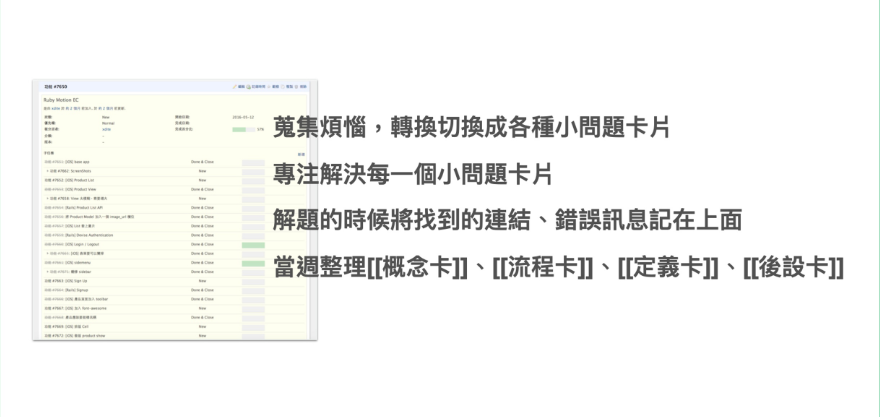

在练功过程中，笔记需要有明确的目标和反思。

我们在职场上，有时候需要纪录自己上班所需场景的操作笔记。或是对于学习职场技能时，记一些学习笔记。

又该如何进行呢？

### Step 1: 将任务先拆分成小问题

拆成小问题的好处是：

当问题颗粒小时，容易完成。当完成时，自己的成就感相对较高。会很像电玩破小章节的爽感。甚至可以解到自己乐此不疲。

而工作上那些难以解决的问题，通常是因为问题颗粒大或是问题模糊。将原始的问题拆分拆散，通常就可以把困难与未知的问题先行隔离出来。将来再回头进行研究实做，我们在工作上就不容易撞墙或失去方向。

。

而我们将之拆细后，就容易绕著具体的问题去搜集资讯。

### Step 2: 将搜集到的相关记录（包括错误讯息），巨细靡遗的记录下来

拆成小问题的好处是：

1. 当问题颗粒小时，容易完成，成就感较高
2. 有些问题难以解决是因为问题颗粒大以及模糊，将问题拆分，就可以把困难与未知的问题先行隔离出来。未来再进行研究实做。就不容易撞墙

再来，当我们将之拆细后，就容易绕着这个问题去搜集资讯。

### Step 2:  将搜集到的相关记录（包括错误讯息），巨细靡遗的记录下来

在学习新技能时，我有一个特殊的习惯：将在学习过程中找到的网址都集中贴在这个任务的留言区中。

我不仅会贴正确的尝试，也会贴错误的尝试和错误讯息。

当然读者读到这里可能会觉得奇怪，贴「正确的尝试结果」可以理解。为什么连「错误的尝试与错误讯息」都要贴进去呢？

这是因为「错误的尝试」本身也是一种「正确」讯息。

有时候在挑战未知的领域时，我们可能会无意中踩到一些坑。如果我们没有标记出这些坑，下次我们还是会无意中踩到它们。而踩中这些坑也可能隐藏著我们某些观念不是很正确，这些坑可能也包含一些我们未来需要学习的新信息。

很多人在学习新技能时很是苦恼，因为要记的线索、资料、资讯实在太多太杂了。也散落各处。

所以我自己才会发明了这个方法，等于是在学习练习时，就「录制」自己学习的过程。且是围绕著该问题集中录制。

将来遇到相似的问题，我就可以打开这个纪录，一捞出来，记忆就全部回来了。

这种方法不仅可以帮助我们更好地记录和整理学习过程中的信息，还可以帮助我们更好地理解和掌握新技能。通过纪录下来的错误讯息，我们可以更深入地分析问题的根源，并找到解决问题的方法。

此外，这种方法还可以帮助我们建立一个个人知识库，方便我们随时查阅和分享。我们可以将这些记录整理成笔记、文章或者书籍，与他人分享我们的学习心得和经验。

### Step 3 : 事后一定要再单独整理一篇总结

当然，「录制」只是这个方法的前半。

另外一半更重要，就是必需要写总结。

过去我在当程式设计师时，工作或学技能时，都是使用这套方法，纪录下我解问题所找到的相关资料，然后将问题解开。

我通常在一两周之内，还会回头看当时的任务记录，再总结发表一篇新的部落格作为教学。

这样做的好处，第一个是复习。

第二个好处，是后面写的那一篇教学就，是以后遇到类似情形可以立即马上再利用的「程序性ＳＯＰ」或「概念」文章了。在未来，不管是他人与自己都可以马上再拿来重复利用。

而不是看著一堆线索笔记或错误讯息，再花上与第一次相同的时间研究解决。

