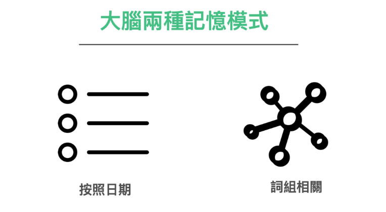
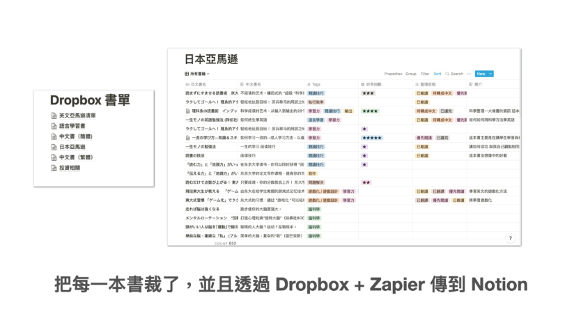
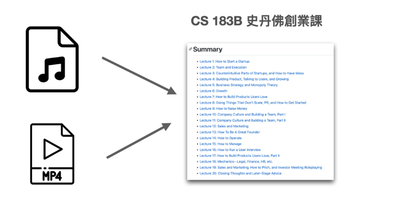

进入「整理」议题之前，在这里，我想先谈一个往往被人遗漏的环节：「提取」。「提取」其实是「整理」环节中一个相当重要的基础。少掉这个环节，基本上会事倍功半。

因为，严格的来说：上一章「记录」篇，我们所记下的东西，不叫「资讯」，甚至也不叫「资料」，只能叫「线索」。

* 资讯是有意义的输入／输出
* 资料是可以拿来整理删改的材料
* 而我们记下的只能叫「线索」，通往资料的索引。

在我们模糊的感觉中，这三者非常相似。但其实在笔记这个领域中，是有巨大差别的。

过去，我们往往花了半条命，专注记回当下学到的东西，或回家整理了好一阵子。过了两个月，再回去翻阅写下的东西，却什么都不记得也没有印象，也不能直接拿来使用。这些，不叫线索叫什么呢？

再进一步说，「线索」还是指当下能让你通往下一道门的材料。我们当时只是记了一些「有趣的东西」，甚至都不是一份「可以直接拿来修改使用的资料」。如果又把线索放到过期了，那就什么也不是了。

### 将线索变成资料

在 [[02-2-随手记　Read it Later & Do it Later]]  中我们介绍了如何快速随手记的诀窍。并说明了第一遍摘下的笔记，其实只需保持时间戳记做为索引。

这是使用大脑的其中一个索引特性：「时间序列」作为原理。我们再将之「标准格式化」（统一转成文字或用照片收藏），之后就容易使用电脑辅助搜寻。

这个流程叫「线索捕捉」。

不过，若这些材料后续要真正能被使用，要能够「搜寻」、「挖掘」、「利用」，其实还需要经过进一步的加工。

读者看到这里，乍看之下可能会觉得有些麻烦。但其实这是必要的。不然当时记得那么辛苦，后来却很难被搜到，搜到以后也没办法用。那不是很可惜吗？

### 如何正确整理笔记：谈谈如何「折衣服」

我相当喜欢用一个日常生活中的概念「折衣服」类比到笔记整理的领域上。

能够快速找到过去的笔记，并很快的能够重新利用。本质上极像从干净且排列整齐的衣柜里面找到想穿的衣服一样。

![[Pasted image 20230818131533.png]]

我们要学的其实只是一套衣柜收纳术。

问题来了，怎么入门？而且，虽然我们知道衣服收纳的重要性，折好以后可以衣服笔挺，想要穿的时候方便取用。但是其实没有人喜欢折衣服。

* 第一个原因：折衣服的过程实在很累。
* 第二个原因：每个人望到笔记专家的衣柜都感到羡慕。

但看到自己堆积成山的衣服，以及面前的空衣柜。一下就浮上超强的无力感。不知道从何下手。

### 引入流程化的概念

我曾经也是笔记苦手。也是经过长久的摸索与尝试之后，才发现当今的笔记术，让我们在学习时掉进了一个大坑。

简单来说，当我们在学习笔记术时，或这些笔记术在教学时都犯了一个很严重的错误。它假设了大家的笔记**都应该从衣服堆直接放进衣柜里面，边放边整理**。

试想：每从地上拿起一件衣服，然后要凭空折好，再放进柜子里面。摆著摆著又看了不顺眼，好像跟型录上美美的照片，看起来很不像。于是你又把叠好的衣服换个位子，加个隔间，调来调去的。

如果我们有五十件衣服要折，如果使用这样的流程。恐怕折到第十件时，心灵与肉体就阵亡了。

那我们应该怎样改善这样的折衣服效率呢？

简单来说，我们

1.        至少要把衣服先分类，相同类型的分成一篮一篮的待折衣物
2.        然后我们再专心的把每一篮的简单折个大概。相同款式或相同颜色的叠一起。
3.        最后在一篮一篮的收进柜子里面

这样起码是比较省力与合理的折衣服方式。

至少你懒得折又赶著穿衣服的时候，也可以直接从分好的上衣篮里面捞衣服出来穿。

![[Pasted image 20230818131351.png]]

当我们把折衣服的这个概念映射到做笔记上，指的是**至少要将资料分篮整理**。

### 收纳衣服第一步：分篮（资讯提取）

那么，我们又要如何开始呢？

我们在前述讲的将记下来的笔记转成统一格式（mp3,mp4 转成文字）。看起来在正常人很多余。其实是必要的环节。

因为这个步骤可以让我们的外部大脑（电脑）快速找到

其实就有点像是至少你可以直接去分类好的篮子拉衣服出来穿的意思

不仅以「日」单位可以方便查找。同时我们也可以利用现代电脑的强大，利用关键字快速找到我们要的资料，而且随处可存取。

至少就达到了「方便取用」的第一步。

我自己甚至会将购买过的纸本书，电子化后，透过 Zappier 将 Dropbox 与 Notion 串接。

这样一来，我就可以快速找到我曾经购买的书籍，并查看我对这些书籍的短评和分类。

同样地，我也会将网上的影音课程转换成文字档，并进行翻译，以便将其收藏成可搜寻的电子书。（在当今科技，这并不是昂贵不可行的科技。OpenAI 的 Whisper 与 ChatGPT API 就可以做到，而这甚至是我在 OpenAI 的服务诞生以前就利用类似科技在进行定期的资料整理）

这样，未来在翻找相关资料时，很快就能用进行文字搜寻，而不需要逐个查找影片或视频。
