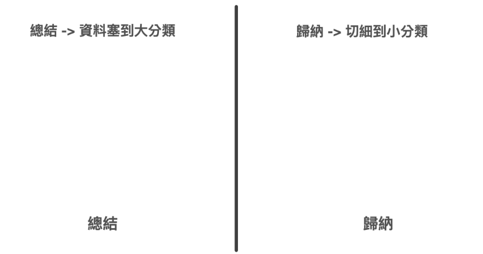
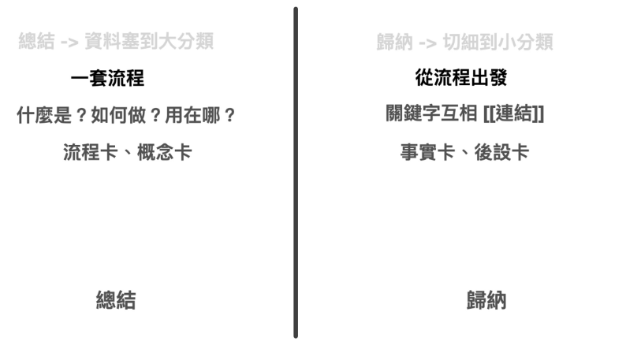

线索 -> 资料 -> 资讯，还要经过两个环节：「总结」与「归纳」。

这两个词乍听之下好像差不多，但其实上本质非常不一样。

「总结」说的是将资料塞到大分类里面。

归纳就是切细到小分类。

我相当喜欢「折衣服」这个概念，是因为当很多人听到，要做出高效笔记，至少要经过「纪录 -> 整理 -> 搜寻 -> 应用」，四道工序，且最好能够多次反复的整理，下次才能很快找到的找到笔记，且找到了笔记之后也能很高效的重新利用..........后，往往直接谢谢再联络。

### 收纳衣服第二步：总结（用特定格式打包资讯）

许多人做笔记一开始就撞墙的根本原因，是因为他们直接先「归纳」再「总结」，而不是先「总结」再「归纳」。

![[Pasted image 20230818131453.png]]

* 总结：塞一起
* 归纳：折起来

先「归纳」再「总结」等于是从地上的洗衣堆里面直接拿衣服，马上折就放进篮子里面。折到几件了又发现篮子分类错，又拿出来调整。结果折好的几件又被搞得乱七八糟了！

基本上我们在折衣服时是不会犯基本错误的，因为这样非常没有效率。

但是我们在整理笔记时却非常喜欢这么做，先开个分类笔记本，对著空白的页面工整的整理誊抄上课笔记，写了一点之后又发现自己整理的不好，只好再开一个笔记本，写没几页又觉得自己搞的一团糟，于是就放弃了笔记整理。

这就是先「归纳」再「总结」的大毛病。

要轻松整理笔记，我们得「总结」再「归纳」。（注）

### 总结 V.S 归纳

这两个概念非常容易混淆。所以这里我们要精讲这两个概念。

#### 1.     总结

这里我推荐使用一套教育界非常知名的知识分类方法「布鲁姆分类法」
布鲁姆将知识分类成四种不同的知识：

*   事实知识
*   概念知识
*   流程知识
*  后设知识

所谓的总结，我们可以取用这里面的概念知识与流程知识。

* 整理一套流程
*  什么是？如何做？用在哪？

归结出一张张「流程卡」与「概念卡」。

#### 2.     归纳

归纳是围绕总结整理出来的流程，去拆解里面的每一个事实，钻研如何将里面的每一个步骤调整的更好。组织围绕出现的关键字。

####  总结与归纳

所谓先「总结」再「归纳」指的是：先整理「流程」、「观念」，再整理当中「个别关键字的定义」。而不是倒过来。

所以，我们一般在写笔记或使用笔记软体都错了，我们一开始不应该从「分类」或名词开始，而是要先散写一篇篇的流程、概念（可以打上日期戳记方便日后寻找）。等累积到一定程度的文章时，我们再整理这些流程，分开到不同资料夹，或者针对里面重复出现的资讯上#tag，或专门写一篇名词解释并且连结到相关文章。

这个流程与概念与当今直观的笔记术是完全相反的。但这才是合乎我们日后取用的最有效方式与格式！

所以，要进行有效的笔记，正确的流程是：

Step 1 ：上课当天的下课，将这些知识的
	*   流程
	*   什么是？如何做？用在哪？
先粗略打包成一篇文章，或一个重复讲述的 vlog 影片。
Step 2: 周末时梳理成一篇一篇的流程（How to? What is?）。
Step 3：每个月的结尾，再进行关键字的精细研究与分类整理。

先「总结」再「归纳」，就可以让你未来在调用这些知识时，你就发不管是「要搜寻」或「直接应用」都很方便快速了。(直接改了就能用)

这样一来，当我们回头看这张流程图时，是否就比较有感觉了呢？

![[Pasted image 20230818131514.png]]

是否就比较有感觉了呢？
