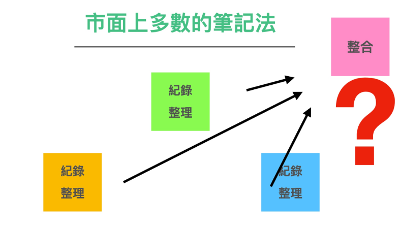
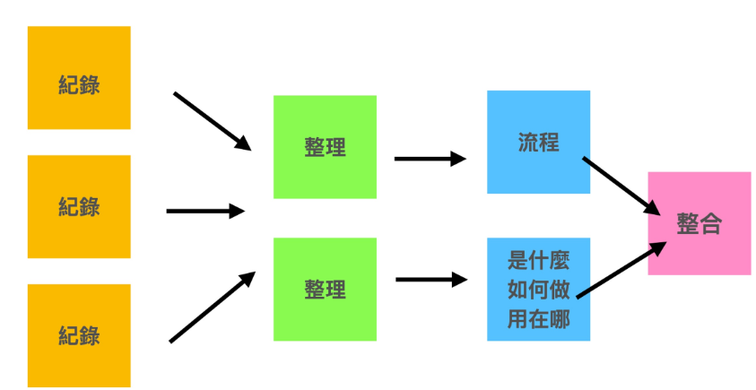
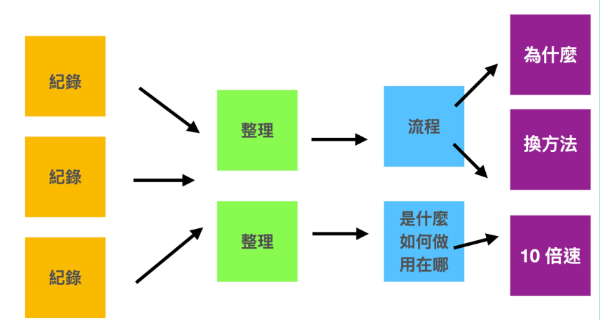

最后，我们想来谈谈笔记最终去向这个话题。当我们做了那么多笔记后，如何拿来整合、应用、输出？

许多人都曾遇到过这样的一个问题，用了市面的笔记法，虽然当下做了很多笔记，最后却无法整合起来。

为什么会出现这样的情形呢？

其实归根究底的原因，就是这些笔记法，多数只是教你记录的方法（或当时纪录整理）。这些当下的资讯线索本身并没有经过梳理，自然也无法整合。

要真正能够整合笔记，做到能够应用、输出的效果。其实真的必须经过这样一套资讯淘洗（纪录 -> 整理 -> 总结 -> 归纳）的过程，才能在后续进行整合动作。

让我将整套流程图展开，各位读者可能就明白了。

我们必须把上课或日常补捉到的散装知识，先行整理封装成一篇篇有目的性的知识，后续才谈的上要修改或整合甚至是改进。

经过这样的流程解释，各位读者是否有恍然大悟的感觉呢？

下一章，我们将回到卡片笔记法以及如何用现代工具实做出这样的效果。