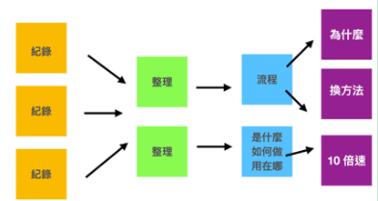

在第二章时，我们曾提及德国社会学家卢曼以及它的卡片笔记法。

「卡片笔记法是由德国社会学家卢曼 Niklas Luhmann 所发明。他在 30 年多年间的研究生涯中，一共出版了 58 本著作与数以百计的论文，当中还横跨多个领域。

当时，他发明了一种卡片笔记法。他将有兴趣与搜集到的资讯，随时捕捉到卡片之上。等到这些资讯卡片累积到一定程度时，就重新整理这些卡片，进行创作。这种卡片笔记法，成了他的高产秘密武器。」

各位读者，在当时可能还对这段叙述，没什么感觉。甚至还会觉得卢曼怎么美国时间这么多，绕一个大圈去整理笔记？

事实上，卢曼第一步作的事情就是，将吸收到的资讯，拆散整理：

续再应用时，利用平常归类好的「流程卡」、「知识卡」就能快速生成新的创作。

这才是卢曼博学多闻且高产的真正秘密！