时间来到两个礼拜后，若照正常进度，这时读者肯定手上已经有一百来篇的笔记。虽然短时间东西算是好找（因为都有标时间，还可以用电脑内建的软体辅助搜寻了）。

但是，面对这么多篇笔记，我们还是希望可以有更有效率的软体协助我们整理。特别是笔记之间，要是可以用关键字自动串连起来就好了。

（如图）

我们点击关键字，就能自动找到相关曾经记载的资讯。这是最理想的操作模式！

为什么我们内心渴求这样的功能呢？

我们点击关键字，就能自动找到相关曾经记载的资讯。这是最理想的操作模式！

为什么我们内心渴求这样的功能呢？

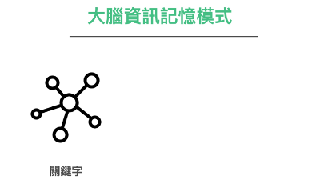

这是因为：在大脑内部，对于记忆本来就是用关键字去串连的。透过一串一串的关键字，逐渐扩大成关键字记忆网路。

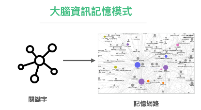

只是，我们的大脑始终并没有那么大的储存空间与检索能量去把我们生活中发生的每一件事都记录下来，所以我们才要靠外部的储存空间（也就是笔记），把尽可能的纪录下来。

但在传统只有纸与笔的世界，要用纸与笔去达成关键字网路这样的效果，却是十分困难。理论上我们

1.     只要把自己一篇一篇的笔记重新整理成一张一张的卡片线索

2.     再将卡片与照日期编号，并贴上各种颜色的关键字贴纸，

3.     再按照知识领域收到不同的卡盒

将来我们需要检索时，就可以很快的找到我们要的资讯！（事实上这就是卢曼的卡片笔记法原理）

但实际上每个人都非常懒惰，不可能有美国时间与毅力去做这件事。（更何况一开始可能就搞错卡片笔记法的步骤了）

但是，现在科技进步了。有没有软体可以达到类似的效果呢？更自动、更省力？

有！这套软体就是 Logseq，在 2020 问世。当初这套软体的发表，让我十分惊喜。

它本身的运作原理，就是使用者书写一张一张的卡片，透过 [[条目]] 与 #tag ，就可以自动串连起来。笔记者可以直接在当则笔记看到过去「相关」笔记的串连与引用关键字。

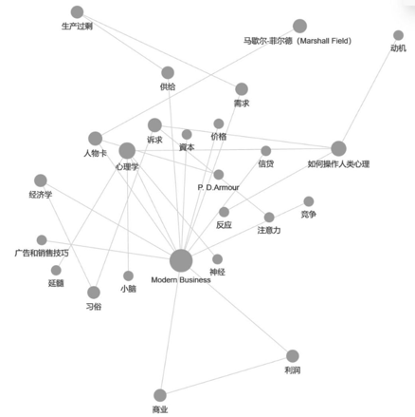

不仅如此，这套笔记一开始就作对了。

这套笔记软体新增资讯的预设两种模式：

* 日志」( Journal ) 模式 : 以日期流水线做为页面名称
*  「词条」(Page)模式: 以词为单位作为页面名称

本身就是搭配大脑记忆运作的方式。

下面我会介绍在 Logseq 下新建笔记的流程方法。

## 模式一：日志模式

Logseq 的两种模式：

* 「日志」( Journal ) 模式
*  「词条」(Page)模式。

词条模式，是在你很确定自己就是要开什么关键字开始撰写时，直接开该词条的页面开始撰写。

而日记模式是，当你暂时还不知道要放哪时，可以将搜到的资讯贴在「日志」上。日后再回来整理

正确的操作流程，是应该先「日志」再「词条」。

许多想要入门卡片笔记法与Logseq 的笔记爱好者，在第一次接触到这套软体时，也有相同的兴奋感。但是打开页面，写下关键字（等于针对名词写卡片定义）后，却不知道怎么开头，也不知道如何才能堆积出这样的网路。

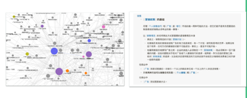

我在前面的章节，提及到之所以会发生这样的情形。是因为「关键流程」错了。

### Step 1: 先用日志模式捕捉「线索」

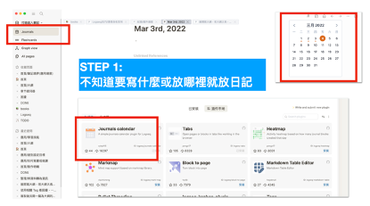

### STEP 2: 使用 ORID 模版格式快速组织

通常我会在日志模式贴入今日随手搜到的资讯。有时候是边看边查边贴到里面。不过呢，有时候只是单纯想要记录今天发生什么事，有什么感想体悟。

为了更有组织性，我会使用 ORID 的模版变成心智成本最低的答题模式，来增加效率。

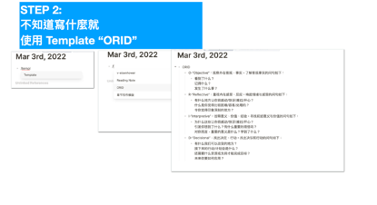

* *  O-“目标”：观察外在客观、事实。了解客观事实的问题句如下：
	-    看到了什么？
	-  记得什么？
	-  发生了什么事？
*  R-“Reflective”：重新看内在感受、反应。唤起情绪与感受的句子如下：
	*   有什么地方让你很感动/惊喜/难过/开心？
	* 什么是你觉得比较困难/容易/处理的？
	*  让你觉得印像深刻的地方？
*  I-“Interpretive”：劝释意义、价值、经验。寻找前描述意义与价值的问题句如下：
	-   为什么这些让你很感动/惊喜/难过/开心？
	-    引发你想到了什么？有什么重要的领悟吗？   
	-  对你而言，重要的意思是什么？学到了什么？
*  D-“Decisional”：找到决定、行动。找到决定和行动的句子如下：
	-  我们有什么可以改变的地方？
	*   接下来的行动/计划会是什么？
	*  还需要什么资源或支持才能完成目标？
	 * 未来你要如何应用？

### Step 3: 将这些线索打上 #tag

我并不是一个「随时整理笔记」的人。不过呢，因为有了 Logseq，我在随手记完之后，会在我认为有意思的段落或句子，先打上 #tag 。

在 Logseq 中，「词条」(Page)是与 #tag 直接相关连的。将来若我要整理专有名词的「专属词条」当时这些被打上 #tag 的段落，就会因为内链的关系，自动被引入显示。若觉得看起来杂乱，那时再梳理不迟。

![[Pasted image 20230626222342.png

### Step 4: 整理成词条 [[Page]]

等这些 #tag 线索累积到够多（大概是 5-10 条），我就会将之整理合并成 [[词条 ]]。

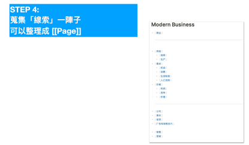

关键字通常是储存

* 一个名词的概述
*  一个概念的解释
*  一套流程的纪录

等等。

## 模式二：[[词条]] 模式

在 Logseq 中，只要使用 [[关键字]] 将关键字框住，立刻就可以形成一个该词的独立节点。或者是点入 #tag 中，也会连到该关键字的词条里面。

场景示范：撰写阅读笔记

1.        开一篇日志纪录我目前正在看的某本书。
2.        这本书可以是密度高的书（使用贴上整本砍句法）或密度低的书（复制金句法）。
3.        等待阅读到一段落（读完整本书，或至少 1-3 章）时，开始二次整理。
4.        二次整理时，我会在句子间，针对我认为是关键字的地方打上 "[[]]" 标记。尚只有模糊想法的大段落，打上 #tag。
5.        Logseq 会针对[[关键字]]、#关键字 自动进行索引串连。若点进去就是独立一页，你可以 Page 词条就 =  维基百科的条目，这是主条目内容是空白的，但下面注释方面会自动显示所有提及到这个关键字的所有页面。
6.        后续你在编辑这个条目时，就可以看著这些相关资讯，快速重新组织这个条目的内容，编写该名词卡。

这当中，如果在词条之内，有看到人名，或书名，我也会立刻先标记人名、或书名卡。通常会有这样的情况，会是当时摘录时，原始资讯所提及。

而这往往是重要线索（就我以往的经历，通常是重要来源，浓度会超高）。

但我在阅读该本书时已经很忙，现在没有空再去追阅另外一本书。我就会利用这个方式先记下。有空时再开书籍卡，阅读被提到的书或作者。

我会另外使用 Logseq 的命名方式Namespace技巧 ，比如说 [[人名卡/巴菲特]]、[[人名卡/查理蒙格]]、[[书名卡/穷查理的普通常识]]、[[名词卡/价值投资]]。

这样以后我只要点进 [[人名卡]]，就可以看到下面有两个条目是巴菲特、查理蒙格。如果这两个条目日后没有内容，但我很有兴趣知道，日后再找时间继续补充整理。

作者再次提醒：

我们在制作笔记甚至卡片笔记时，不应该一开始就先写「名词卡」。

而是应该先塞进一堆还未梳理的知识，然后帮这堆东西先打 #tag ，等 #tag 累积到一定程度后，再用 page 收集起来。

## 模式三： #tag 模式

在 Logseq 中，使用 [[关键字]]或 #关键字，通通会连到词条。

可能有读者会问这两者使用时机的差别。

基本上我会用 [[关键字]] 去框我很确定的「名词」、「概念」。而使用 #tag 去对一个段落下注解。

而且在使用上，我们甚至可以对一个段落去打上很多个 #tag 做为注解。

比如说在整理资料时，我会偏好先用 #tag 去梳理一沱资料。

以下当时笔记读书会的问卷回应。为了要快速将这些资料分类。我将所有的回应都先打上 #tag，然后再去统计到底 #tag 的数量。

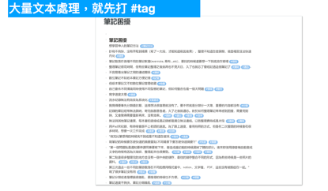

再逐一合并 #tag，找到真正的大分类。

## 模式四： namespace 模式

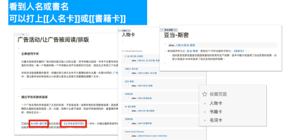

我们在前面提及了，读书遇到特别的人名与书名时，我们可以将之拆分出去。这时候会遇到 NameSpace 功能。Namespace 直译是「命名空间」，用于同一个条目里面有很多细项时，可以拆出类似资料夹的索引手法。

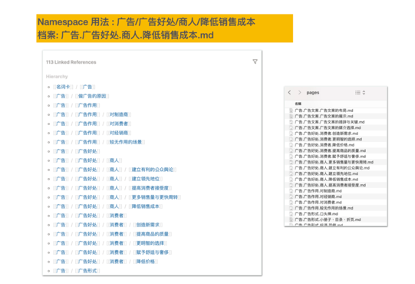

比如说这是 Modern Business 这套书，广告这一节的笔记，当初这个词条资讯量实在太大。于是我用 Namespace 功能，拆成多层去收纳。

笔记要拆到多细呢？我自己的原则是笔记最好是维持在 1-2 个卷轴之内可以一目了然看完，太大了我就会拆出去。

## TODO  模式

在整理笔记时，有时候常常读著读著就会萌发出新想法，或关键字。

但当下没有空追溯填补。

这时我会使用 TODO / DOING 的关键字，将想法变成 Do it Later放著。

等待下次有空时，再接续之前的研究进度。（点入 [[TODO]] 这个词条就可以看到有哪些条目待办）

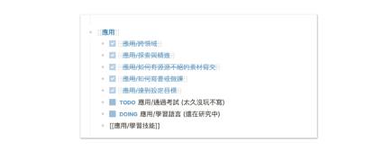

## 模式六： Query

Logseq 本身就内建关键字关连功能，而 Query 技巧是在当页面强行拉进你觉得有关的关键资料并展现。

通常我会在做研究比对时，利用页面这个内建功能进行横向比对。

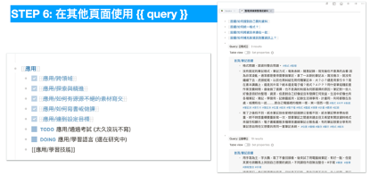

## 模式七： Template

Logseq 还有一个进阶功能，就是 Template。但本书在这里不做操作示范。只叙述概念。

Template 是指你可以将类似结构的东西储存成模版。下次要开类似类型的节点，可以直接用快速键复用。

一般来说，我最会常会在 Logseq 上储存的卡片模版有几种：

*   名词卡
	-  是什么？
*  流程卡
	-  如何做？
* 后设卡
	*  如何做得更好？
* 书籍卡
	*  相关进阶书籍
	*  人名卡
	*    作者相关书籍
*  模版卡
	* 文章写作模版
	*  书籍写作模版
	*  任务跟踪模版
	*  会议纪录模版