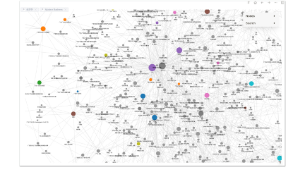

vergreen note（长青笔记）是一个用于描述一种永远保持价值和有用性的笔记或文章的概念。意思是做出一份记不受时间限制，不论过了多久都能保持其可靠性和相对的不变性的笔记。

这种笔记通常涉及一个主题或概念的深入探索，提供有价值的见解、观点、知识和资讯。高度结构化、时常更新，这份笔记得读者让笔记服务的读者，可以随时查阅和参考，并且在各种情况下仍然有价值。

这是笔记人在笔记领域的最终目标，但这也是存在梦里的一个目标。

因为，事实上长青笔记，受限于笔记载具（纸笔、软体、笔记检索方式、笔记更新方式）的限制，实在太难达成了。

而且，人类都是懒惰的。我们都希望最好做笔记时，能够Write Once, Use Anywhere。

这世界上最好可以有人发明套笔记法，能让我们做到当初只要记一次，后续只要不断复看这本笔记本，就能达到最大学习效果。

后续再拿出这本笔记本时，也可以从这里面快速取用资讯，立刻实战应用。

世界上存在这种笔记法吗？

我希望它存在。因为我也懒。

但事实上这套笔记法不存在。

不仅不存在，这个想法还是因为我们受限于纸笔工具，才「幻想」出来的「可能」的解决方式。

我当时在重新梳理笔记流程时，发现这个原因时，也相当震撼。因为在我们一路走来的学习生涯中，一路都在追求这个懒人圣杯，一直都在等终极笔记法出现。

却从来没有思考过，其实这个「圣杯」与原先我们用的笔记流程、所做的努力方向、产出效果是如此不合理。

## 「整理」笔记而不是「写」笔记

我还想在本书带出一个新概念，新流程：也就是「笔记」是要用「整理」出来的，而不是写出来的。

笔者观看这本书的时候，是否有留意到笔者在数位笔记流程一个不寻常的笔记习惯。就是对于资料的堆积与梳理。都是用**录的、贴的、砍的**。

1.     录下上课的内容，转成逐字稿
2.     直接复制书籍里面的金句、段落贴进笔记，砍掉自己不要的

相较于他人的笔记都是「自己重新写过」。这种大胆的笔记手法，很不寻常。

其实不是我的手法大胆新颖。而是我把动作放大放慢了。

这里让我重新播放我们上课时的情景：

这里让我重新播放我们上课时的情景：

#### 上课场景

* Step 1: 老师讲课　（我们抄下内容）
* Step 2: 我们对于刚刚抄下的内容　（想出我们自己的见解）
* Step 3: 我们重新看著我们的笔记　（重新写出新词条）

#### 看书场景

* Step 1: 阅读书籍　（我们摘抄书上的内容）
* Step 2: 我们对于刚刚抄下的内容　（想出我们自己的见解）
* Step 3: 我们重新看著我们的笔记　（重新写出新词条）

我做的是

1.     让机器去做摘抄的动作（对课程录音或复制书上段落）。
2.     我不马上重写笔记，只当「笔记内容编辑」，剪下觉得有价值的段落
3.     我不马上整理笔记，而是在「有空整理」的时间，透过「整理」的方式，「归纳」出新词条。

这的确是「笔记流程」: 录下资讯 -> 筛出有用的内容 -> 重新内化。

但每一步，这个新方法都更省力。「不花脑力」且「不需立刻执行」。

而且效果更好：原始内容保留的更多，自己最终整理的结果，越接近自己的洞见。

### 用对大脑省力的方式，生出品质更好的笔记

传统笔记流程之所以辛苦，是因为以下原因。

#### 1.     即时算力要求太高

我们在学习一个新领域时，不但要同时纪录，还要同时整理，甚至还要同时生成。这对于大脑来说，即时算力的要求太高。

#### 2.     对于新领域掌握不够

我们对于一个新领域要产生洞见，必然是要先大量搜集知识，才能解析出他们当中的关连性与重要性。

然而在上课时，光「大量搜集知识」，我们就没有足够的时间与算力可以进行「解析」了。

#### 3.     生成新内容的要求算力太高

大脑生成新记忆的原理并不是凭空创造一段新内容。而是基于「已知的节点」，在彼此之间生成新的连线。

但在学习一个新领域知识时，大脑并不知道哪些是「有效节点」，更遑论生成「有效」连线。

基于这三个原因，上课即时做笔记，对任何人都是苦差事。

但是如果我们改用放大放慢的新流程，去「整理」笔记，效果那就完全不同了。

首先我们是从复制贴上一本书的精髓开始。

1.     首先我们第一个跳掉了「记录」的步骤。
2.     第二，从中砍掉自己不认同不理解的句子。
3.     第三，以软体「大量重复」浮现的关键字作为基础，看出「关连」，并以新视角去重新创造「自己的看法」

以这样的省力流程去「做一份笔记」，不仅分散算力，更能够把绝大多数的脑力用在关键动作：「找关连」，出来的最终笔记，品质反而是比较高的！

### 记忆是基于「重复」而不是「生成」

当然，读者乍看一下这种新流程，可能会有稍许疑惑，这样的流程，似乎不过脑，真的能有效吸收？

让我来仔细解释，大脑的记忆原理。这样的笔记方式，其实并不是「不过脑」，而是「过很多遍脑」。

首先

1.     在整理笔记的时候，首先这个新领域的关键概念一定会浮现在你面前「非常多遍」。

2.     我们是在「重复看到非常多遍」同样的新东西时，觉得放在那边看起来很烦，于是应该要收纳起来「放在一个新地方」，才另开一个词条「归纳新意义」。

大脑对于一个新资讯是否有意义，判断的规则是：

1.     是否一直重复
2.     是否与旧记忆中的「元素结构」「重叠」（相同意义）

所以这样的新流程，首先就会让我们在阅读时，看过很多遍。只是一点都不费力而已。

而我们最终又会重写这个词条。「重写」的动作在大脑的角度，就是「生成新的连线」。

而所谓「记忆」是这个「连线」被「重复」刻画多次。

我们可能会对于这个新流程感到疑虑，那纯粹是我们被以前的「费力」才能「记住」这个印象所绑架了。

新的流程可以让我们在做笔记时五倍省力，而且还有五倍的记忆效果。因为你可以重复这个流程非常多遍却一点都不累。

同样的时间与精力，原本我们连抄下笔记的时间与精力都不够。但在新流程下，我们可以拿来做 3-5 遍以上的粗整理、细整理了。

有经过仔细整理的产出，当然是更好的学习成果。

### 「洞见」就是原创笔记

读者对这个笔记法的第二个疑虑：可能会担心如此写出来的笔记，最后只是复制原作者一份内容，可能没有什么学习上的帮助。

非也，在我的实测成果中，用这样方式的流程与梳理，透过交叉「整理」「挖掘」，我还常常出与作者截然不同的观察洞见，产生意外的惊喜。

（我在后面的章节会提到为什么会有这样的结果）

读者对这个笔记法的第三个疑虑：可能是笔记内容的原创性与著作权。

复制与摘抄真的可以吗？

首先，我们自己写的笔记放在我们私人笔记夹里面的草稿、整理箱。我们摘抄笔记是「使用」作者的内容，但是著作权谈的基本上是重新制作与公开。

只要你不公开自己的研究笔记，基本上没有踩线的问题。

第二，世间作品很少处于原创状态。大多数的创作与笔记，几乎都是口水笔记。一定是看了前人的示范资讯，才会有手上的这份笔记。

上面的「概念」「定义」「流程」早就存在世界之中。「概念」与「定义、「流程」的摘录、整理，并没有什么「原创」问题。

而笔记严格的定义，指的是你看完这些「概念」、「事实」的「内容组织结构」的一手角度「意义重述」。

最后我们的笔记一定经过自己的多重组织、整理、编修，最后产出的新结构、新想法，最后怎么可能还会跟原作一样呢？

而且，用传统流程根本不可能造出「长青笔记」，谁有可能有那种「脑力」啊！

长青笔记当然是要靠这种「复制」、「砍掉」、「重新整理」。才能不断的进化。保持新鲜。

这本笔记，内容每天可以不断的进行翻修、增添、重新连结。而且我们还可以轻松的从中找到有效的资讯，并快速应用出来。

现在，你知道我是如何在两三个月内，就读完千万字巨作 Modern Business ，并且做出几千则交叉连结笔记的秘密了吧。

这放在以前，一次读破经济巨作并且还能自己整理几百条新洞见对我来说根本是想都不敢想的事。如今却完全不是什么费力的事。甚至，我还越读越上瘾。

好像在玩整理纸箱发现新宝物的寻宝游戏一样！

在此前，我甚至也未想像过做笔记甚至可以是一件能够成瘾的事。