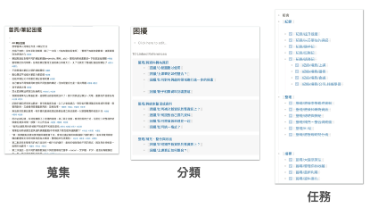

看到这里，各位读者应该会开始知道，这本书本身是怎么淬炼出来的？

我正是类似这样的方法 + 卡片笔记法 + 笔记软体 Logseq 做出来的。

当时，我原本试想开一个 Logseq 的读书会，分享软体的使用技巧。于是发放了一个读书会的问卷调查表单，结果没想到想参加的人，提出的问题，全部都不是针对这门工具的。而大家对于平常在做笔记上，有很多还没被解决的基础流程难题。

看完之后。我觉得这些问题，我自己也相当感兴趣最终答案。于是在收到这一百多个问题，我就先将问题进行清洗：一条一条贴进软体内，然后再为它们打上 TAG。

打过了一两轮 TAG 后，我发现这些问题，主要具拢在五大主题上：

* 纪录
* 提取
* 整理
* 搜寻
* 应用

这五个类别下，有各自大概十数条难题。有些难题是我曾解过的，有些则是我没碰过但稍微搜寻一下，可能当今世界上答案已经存在的。

我试著将我能回答的问题，一一耐心整理完。一回头就发现，这里面经过流程梳理后，笔记世界里面 90%的问题差不多被就破解完了.....

不仅如此，为了整理出一份易于理解的读书会投影片。

所以我努力构思了一些较为形象的概念比喻：比如「用折衣服服比喻总结与归纳」、「用打猎切肉比喻资讯淘洗」、「用煮菜吃饭比喻资讯吸收」。

许多相关的细微解法，在比喻的领域流程「搬移」下。甚至也很轻松的被挖掘出来。

如果读者本身是研究者，若要进行一项新领域的挑战，或者要展开一项新领域、兴趣的挑战，不妨用这个新的「搜索」方法流程、整理你的问题、整理你的笔记看看。极有可能会产出令人惊喜的结果。