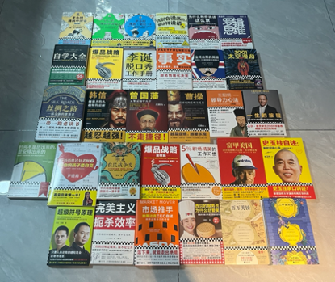
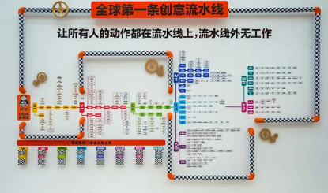

经过以上示范。各位读者应该不难了解为什么当年发明卡片笔记法的卢曼教授，有办法横跨那么多领域，同时也那么高产了吧！

不是靠单靠一套软体或方法本身，而是我们要对处理的资讯与问题

* 纪录
* 淘洗
* 定义
* 结构重整

才能更快速的存取有效资讯，再次利用。

我们前面讲述了四大主题：纪录、提取、整理、搜寻。这一章我们要来深入讲应用。

## 任何创意工作都可以流水线化

这里我想要提出一个新颖且令人震惊的观点，就是使用这套新流程后，关于任何创意工作都可以工业化、流水线化，做到高效产出。

而且这个方法并不是一个假说，而是一个已被实践的现实。

让我谈谈一个你可能不知道的例子。中国最近有一间「读客文化」出版公司，正在快速的窜红。但它们其实也不算是快速的在窜红，而是它们出版的书，在中国这么竞争激烈的书市，每一部都是现象级的「大卖特卖」。

从「藏地密码」、「生死疲劳」、「银河帝国」、「沙丘」。不管是新书还是公版旧书，在它们手上就是能卖爆！

们之所以会快速窜红。事实上是大家到最后发现，咦，这些我们不由自主就会买回去的书，怎么都是「读客文化」做出来的。

让我跟你讲讲一些「读客文化」震惊的数据与事实：

* 某一本公版书全市场10年卖了 5 万本。在读客手上卖了半年就卖了 15 万本。
*  每一本书稿进读客，不到1个月就可以完成包装上市。
*   每一本公版书基本上销量都是其他人的至少 5 倍甚至 10 倍以上。
*  读客那极度吸睛，极度催动人购买欲望的封面，设计与构思时间平均最多花1个小时。（就算你用 ChatGPT 写文案 与 Stable Diffusion画设计稿都没有它们快）
*   读客已经把它们全公司的出版流程，细化成 4300+ 的 SOP，正在顺畅的执行创意工业化。

换言之，读客文化完成了一个「白领界」都想要（老板想要）或不想要（员工不想要）的「现实」：将创意产业工业化，将成功方程式人肉自动化。

How?

## 汽车产业可以工业化、创意产业也可以工业化

读客文化的老板华楠在 2023 年初公开了它们的秘密诀窍：读客方法论。但我觉得比起想法，它们的精神与贯彻执行更加值得令人学习。

这套方法并不是华楠在读客发明出来的。而是华楠在前一家公司华与华广告咨询营销公司，就摸索出来的。华与华是中国四大广告公司之一，传奇中的传奇，华与华是华楠与华杉共同的创办公司。坊间流传的华与华超级符号创造方法就是它们发明的。

华楠受不了广告业的高强度产出之后，希望把这套方法论移植到广告可以批量搭载的商品上，也就是书籍市场。后来创办了读客文化，才有了这套新的读客方法论。

将「创意产出」工业化，这种对文化人的天方夜谭的目标。­始于他的一个研究契机：研究汽车工业的工业化始祖 Model T是怎么被造成的？

很多人大概难以想象，现在大幅自动化的汽车生产行业。在 100 年前生产效率非常的低。

组装一台汽车可能需要花费数天到数周的时间，具体取决于该工厂的规模和生产效率。许多零件需要手工安装和调整，而不像现代生产线那样可以实现快速且精确的自动化装配。就算是火力全开。福特在当时 1 年最多也只能生产 10607 辆。

亨利·福特意识到，如果将生产过程分解为一系列的简单步骤，并让工人专注于其中一个步骤，然后将汽车在制造过程中沿著流水线进行移动，每位工人只需负责特定的任务，那么生产效率就可以大幅提高。

福特公司后来借鉴了芝加哥屠宰场的流水宰制流水线，在1913年推出了著名的「T型车」（Model T）并引入了流水线生产技术。这种制造方式使得汽车在装配过程中按照一定的顺序在工作站之间移动，每个工人专注于自己的任务，从而节省了时间和成本。例如，一个工人专门负责安装轮胎，另一个工人负责安装引擎，而另一个工人可能专注于安装车身等。

这种流水线生产方式带来了多方面的好处。首先，它大幅提高了生产效率，大大缩短了生产时间。同时，由于每个工人只需掌握特定的技能，培训和人力成本也得以降低。此外，流水线还有助于标准化和质量控制，因为每个车辆都经历相同的装配过程，减少了变异性和错误。

福特公司的流水线生产模式革命性地改变了整个汽车行业的制造方式，使得汽车的生产变得更加高效、快速且可靠。福特 Model T 汽车流水线在后续的 19 年内，就生产了15458781辆（平均每年80多万辆）。

而在1948-1975 年，日本的丰田汽车，更提出了丰田生产方式，其中的 Just in Time 与看板(Kanban)工作法，更将整个汽车业界生产效率提高到另外一个境界。

目前汽车生产在流水线化、机器自动装配化的技术帮助下。特斯拉的中国超级工厂，目前生产汽车的速度是难以令人置信的 1 分钟 1 台（Model Y）。

正是汽车工业从高度手工业，变成高效自动产出，才让华楠觉得「创意流水线化」是高度可行的。

## 纪录、梳理、检核、SOP模版

华楠决定借鉴汽车产业这个概念，对文化产业进行改造。他发动全公司员工「纪录」日常的各样出版工作。总共梳理了四千多条 SOP，并且「分类」了八大模块：版权、研发、生产物流、地面销售、网络销售、全版权运营、营销推广、新媒体运营。

并对每一个模块梳理各自的流水线，并且对流水线上的流程「编号」。

每一个被编号的流程都有 SOP、检核表、操作模版。这些 SOP 由公司的流程委员会审定。每个员工都可以提出建议改进（并有奖金），经过流程委员会审批之后会更新。所以流程 SOP是周周在改进的「长青笔记」

而且这套流程效率有多夸张呢？本来很多读客外的同业对这套方法是有存疑的。但读客也很大方的每个月举办读客工作坊，甚至邀请嘉宾一起参与封面创作，使用它们的「一个小时创意车间」方法创作封面。

我的朋友也曾经参与过这个工作坊，它们在参加这个过程前，从来没有设计过一本书的封面。在读客方法的辅助下，一组新手，竟然也在一个小时内完成对市场的调研（称：寻宝报告）并设计出读客风格的封面与文化。（再次强调，比 AI 软体： ChatGPT + Stable Diffusion 双开还快）

当然，你会对将出版工业化有所存疑。认为会不会扼杀创意？

读客认为不会，它们认为正是要将这些琐碎流程固定化，成功模式结构固定化。员工才可以专注在寻找元素之间的创新。而后续的产出成绩与销售成绩也证明了它们这套方法的实用性与可靠性。

## 将自己的笔记、工作模版化

读客的这套流程对笔记方法有什么启发呢？

我们常常认为，工作上日常中学到的概念、是很难被拆解的。抄下来的笔记是很难被复用的，工作是很难被分派出去的、效率是很难被提升的。

但事实上这当中更大的原因只是我们分解的不够细致、不够模版化、不够流程化。

只要当你能建立起自己的资讯消化流程、累积出足够的知识模版，你的创意、洞见产出质与量就会快速的提升。

在本章，我将介绍本书在写作上的素材整理、用到的内容模版，提供大家作为灵感。