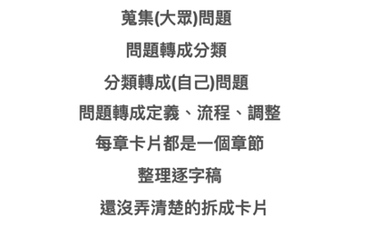
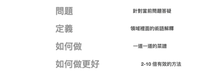
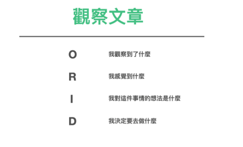
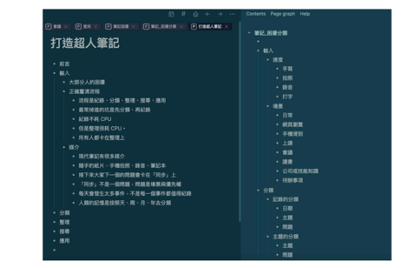
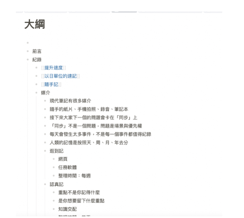
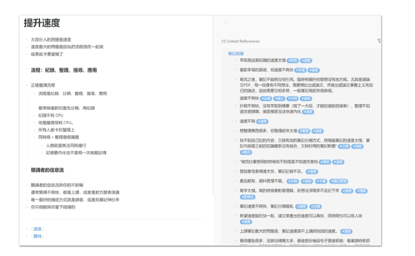

## Step 1: 搜集所有的困扰

这本书的素材，是由当时我的笔记读书会上搜集问题衍生而来。里面总共有100多条困扰。我大概归纳出大概是需要解决这 20 条问题

1. 笔记速度不够快，无法快速摘要重点。
2. 笔记散落在不同的笔记软体中，寻找困难。
3. 笔记整理困难，容易遗忘。
4. 笔记之间的连结关系不明显。
5. 笔记无法有效地应用和分享。
6. 笔记容易遗失或无法快速找到。
7. 笔记无法有效地整理和归纳。
8. 笔记无法快速记忆和内化。
9. 笔记无法有效地搜寻和提取资讯。
10. 笔记无法有效地转化为行动。
11. 笔记分类和标签混乱，寻找困难。
12. 笔记无法有效地记录和整合不同形式的资讯。
13. 笔记无法快速摘要和理解。
14. 笔记无法有效地连结和串联不同的知识点。
15. 笔记无法快速找到相关的笔记知识。
16. 笔记无法有效地整理和应用学习心得。
17. 笔记无法快速抓住重点，尤其是跨领域学习。
18. 笔记无法有效地拓展自身能力和领域。
19. 笔记无法快速找到相关内容和解决问题。

## Step 2: 分类

可以将这 20 个主题，粗分为
*  输入的场景
*  想提升的境界
*   如何进行整理
*  如何进行搜寻
*  如何进行高效应用
*  如何进行跨领域研究

## Step 3: 进行研究

对这 20 个主要的问题，进行过去的流程、经验概念提取、他人解法的研究。

### (1) 概念与流程笔记

1.        点出问题
2.        定义这个问题
3.        叙述流程
4.        怎么样把这件事做到更好

### (2)观察与感想笔记

* *  O-“目标”：观察外在客观、事实。了解客观事实的问题句如下：
	-    看到了什么？
	-  记得什么？
	-  发生了什么事？
*  R-“Reflective”：重新看内在感受、反应。唤起情绪与感受的句子如下：
	*   有什么地方让你很感动/惊喜/难过/开心？
	* 什么是你觉得比较困难/容易/处理的？
	*  让你觉得印像深刻的地方？
*  I-“Interpretive”：劝释意义、价值、经验。寻找前描述意义与价值的问题句如下：
	-   为什么这些让你很感动/惊喜/难过/开心？
	-    引发你想到了什么？有什么重要的领悟吗？   
	-  对你而言，重要的意思是什么？学到了什么？
*  D-“Decisional”：找到决定、行动。找到决定和行动的句子如下：
	-  我们有什么可以改变的地方？
	*   接下来的行动/计划会是什么？
	*  还需要什么资源或支持才能完成目标？
	 * 未来你要如何应用？

## Step 4: 写书籍大纲

我最终将所有的笔记领域，重新梳理出一个新流程：「纪录 -> 提取 -> 整理 -> 搜寻 -> 应用」

并根据这个五大分类，开始构思大纲。

接著将这些题目整理成详细大纲，若太长则切割为写作卡片。

根据每一个大纲的标题，我先粗略展开写上 5-10 句，我对这个事情的感想。

等感想大致写完。我再看著这 5-10 句的感想线索、搭配原先问题的关键字，重写成一篇的文章。

而这些文章就会变成一篇一篇有效的资讯。

## Step 5: 重新整理成书籍章节

等到我重新重写了这 80% 的文章稿。（这通常是第一遍书稿）

我就会进行二次三次的整理。

也许是将所有的内容做成一份更直观的投影片，透过整理投影片的过程，让整个内容可以有更立体的浓缩与对比。

又或者是直接重写成书籍的章节结构，重新调整安排内部的内容比重。

### Step 6: 利用内容矩阵形式，构思章节内的可能标题与内容

Nicolas Cole 在 《The art and business of online writing》提到互联网上有常见的五种文章形式。

1.     可操作指南(Actionable Guide):提供读者具体例子和步骤的长篇指南文章。
2.     意见(Opinion):表达作者观点或立场的文章。
3.     整理清单(Curated List):提供精选信息或资源的清单式文章。
4.     故事(Story):讲述一个故事或案例的文章。
5.     可信的评论(Credible Talking Head):邀请专家学者发表专业意见的访谈式文章。

比如我们原先在笔记的这 20 个困扰，按照这 5种文体，就成了 20 篇可以撰写的角度：

#### 1.     可操作指南(Actionable Guide Form)

* 如何提升笔记速度，快速摘要重点的技巧和步骤
* 如何避免笔记遗失和快速找到需要的资讯
* 如何有效分类和标签笔记，解决寻找困难
* 如何整理和应用学习心得的实用步骤和方法

#### 2.     意见(Option)

* 笔记软体整合的重要性：为什么将笔记集中在一个平台上有助于解决寻找困难
* 简单笔记整理策略的价值：如何快速归纳笔记内容
* 整合不同形式资讯的笔记方法：如何记录和整合文字、图片、音频等多媒体资料
* 在跨领域学习中笔记如何抓住重点

#### 3.     整理清单(Curated List Form)

* 最佳笔记记忆和内化方法的精选清单
* 快速摘要和理解笔记的工具和技巧清单
* 5个有效的笔记整理方法，帮助您避免笔记遗忘
* 扩展笔记能力和领域的推荐资源清单

#### 4.     故事(Story)

* 如何运用笔记连结关系解决实际问题：一个成功的案例分享
* 一位学习者如何透过笔记搜寻和提取资讯，解决学习困境的故事
* 透过笔记连结和串联知识点，我如何完成一个跨领域学习专案
* 如何透过笔记找到相关内容

#### 5.     可信的评论(Credible Talking Head)

* 专家观点-分享笔记的最佳方法和工具，提高有效应用和分享能力
* 专家观点-对笔记转化为行动的看法和建议
* 专家观点-如何快速找到相关笔记知识，提高学习效率
* 专家观点-笔记如何记录和回顾个人成长和学习经验的重要性